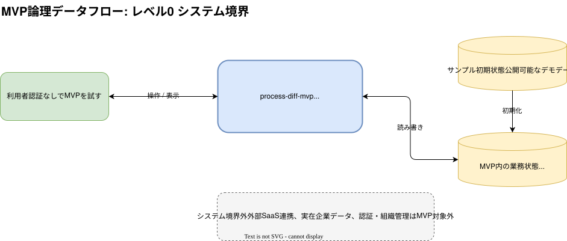
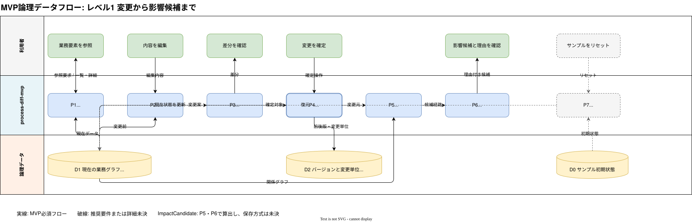

# MVP論理データフロー設計

## 1. 文書情報

| 項目 | 内容 |
|---|---|
| 文書状態 | 現行业務フロー実装済み・認証境界は追加設計済み |
| 対象 | 組織別MVPの中核フロー |
| 設計レベル | 論理設計 |
| 最終更新日 | 2026-08-09 |

この文書では、利用者が業務要素を参照し、変更前後の差分と影響候補を確認するまでの
処理とデータの流れを定義します。

この設計はMVP開発開始時点の仮説であり、完成仕様として固定しません。実装や検証で得た
知見に合わせて、関連する変更と同じPull Requestで継続的に更新します。

この文書では画面、API、データベース、ブラウザ内状態などの具体的な実装方式を扱いません。
サービスの目的と機能要件は[要件定義](../requirements/README.md)、データの意味は
[ドメインモデルと影響判定要件](../requirements/domain-and-impact.md)、永続化する構造は
[MVPテーブル設計](table-design.md)、具体的な実装方式は
[MVP技術選定](technology/README.md)、利用者に見せる状態と操作順は
[MVP画面構成とユーザーフロー](screens-and-user-flow.md)を参照してください。影響候補の
算出規則は[影響候補の探索仕様](impact-search.md)、組織別状態とリセットは
[組織別サンプル状態の管理](demo-state.md)、認証・組織を含む次期処理境界は
[認証・組織ワークスペース設計](authentication-and-organization.md)で定義します。

## 2. 図の管理方法

- [mvp-data-flow.drawio.svg](mvp-data-flow.drawio.svg)を図の正本とし、レベル0と
  レベル1の編集情報を保持する。
- [system-context.drawio.svg](system-context.drawio.svg)は、レベル0をMarkdownへ
  埋め込むための表示用ファイルとする。レベル0を変更したときは、正本から同じ
  Pull Requestで再生成する。
- SVGとしてMarkdownやGitHub上で表示でき、VS Codeのdraw.io拡張でそのまま編集できる
  形式とする。
- 図はVS Codeのdraw.io拡張、またはdraw.io互換のエディターで開く。
- この文書では図の判断根拠、処理責務、データ責務、未決事項を管理する。
- 図の処理またはデータを変更するときは、同じPull Requestでこの文書も更新する。
- 実装方式が決まった後も、この文書では技術名ではなく論理的な責務とデータを扱う。

レベル1の現行図は認証後も維持する「業務変更から影響候補まで」のdomain flowを表します。
session、membership、organization scopeはすべての取得・更新に先立つ共通境界として追加し、
図の各処理へ同じ線を重ねません。レベル0の図は認証なしの現行実装を示すため、実装Pull
Requestで認証済み利用者と組織境界を含む図へ更新します。次期境界の正本は
[認証・組織ワークスペース設計](authentication-and-organization.md)です。

## 3. レベル0: システム境界

図を編集するときは、[draw.io図面の正本](mvp-data-flow.drawio.svg)の
「レベル0 システム境界」ページを使用します。

システム境界の外から入るのは利用者の操作だけです。MVPでは外部SaaSや実在企業の
業務データを取り込まず、あらかじめ用意したサンプル初期状態を利用します。

実装では、確定済みの現在状態と履歴をPostgreSQL、未確定の変更案をブラウザ内状態へ
配置します。この図では、実装場所にかかわらず必要になる論理的な状態として表現します。

## 4. レベル1: 変更から影響候補まで

図を編集するときは、[draw.io図面の正本](mvp-data-flow.drawio.svg)の
「レベル1 変更と影響候補」ページを使用します。

破線は、MVPで推奨要件となっているリセット処理であることを示します。

## 5. 処理の責務

| ID | 処理 | 主な入力 | 主な出力 | 対応要件 |
|---|---|---|---|---|
| P0 | session・組織権限の検証 | session、organization、membership | 認証済み利用者、認可済みorganization ID、role | FR-502、FR-505〜FR-510 |
| P1 | 業務要素と関係の取得 | `BusinessEntity`、`Relation` | 一覧、詳細、直接関係 | FR-001〜FR-004 |
| P2 | 変更案の保持 | 現在の内容、編集内容 | 未確定の変更案 | FR-101、FR-104、FR-105 |
| P3 | 差分の生成 | 現在の内容、変更案 | 追加、削除、変更箇所 | FR-201〜FR-203 |
| P4 | 変更の確定 | 認可済み組織、認証済み利用者、確認済み変更案 | 更新済み要素、`EntityVersion`、変更者を含む`ChangeSet` | FR-102、FR-103、FR-508〜FR-509 |
| P5 | 関係グラフの探索 | 変更元、`Relation` | 影響候補と関係経路 | FR-301 |
| P6 | 候補表示の組み立て | 影響候補、関係経路 | 重複のない候補、提示理由 | FR-302〜FR-305 |
| P7 | サンプル状態の復元 | owner権限、organization ID、サンプル初期状態 | 現在の組織だけの復元済み業務状態 | FR-404、FR-510〜FR-511 |

## 6. 論理データの責務

| ID | データ | 内容 | 更新契機 |
|---|---|---|---|
| D0 | サンプル初期状態 | デモ開始時の業務要素、関係、内容 | アプリケーションの提供時 |
| D-A | 認証・組織 | `User`、`Session`、`Organization`、`OrganizationMembership` | 登録、サインイン、onboarding |
| D1 | 現在の業務グラフ | `BusinessEntity`と`Relation`、各要素の現在内容 | 変更確定またはリセット |
| D2 | バージョンと変更単位 | `EntityVersion`と`ChangeSet` | 変更確定 |
| 算出値 | 影響候補 | `ImpactCandidate`相当の候補、関係経路、提示理由 | 変更確定後の探索 |

`ImpactCandidate`は、保存必須のデータストアとしては扱いません。同じ入力と関係データから
同じ結果を再現できることを優先し、確定済みの変更結果を表示するときに都度算出します。
D1とD2はorganization IDで分離し、D-Aで認可された組織の状態だけを処理します。

## 7. 状態遷移上の設計判断

### 7.1 変更案と確定済み変更を分ける

編集開始から差分確認までは未確定の変更案として扱います。`BusinessEntity`の現在内容、
`EntityVersion`、`ChangeSet`を更新する境界は、利用者が変更を確定した時点とします。

### 7.2 現在状態と変更記録を一つの変更単位で更新する

P4では、現在内容の更新と変更前後のバージョン、`ChangeSet`の記録が論理的に一つの操作と
して成功または失敗する必要があります。PostgreSQLのトランザクションを使用し、具体的な
driverと呼び出し方式は実装開始時に検証します。

### 7.3 影響候補は確定後に探索する

影響候補の探索起点は、確定した変更の対象となった業務要素です。未確定の編集内容を使った
プレビュー探索はMVPの必須範囲に含めません。両方向へ最大2段階探索する具体的な規則は
[影響候補の探索仕様](impact-search.md)で定義します。

### 7.4 探索結果を再現可能にする

同じ変更元、関係グラフ、探索条件からは同じ候補と関係経路を返します。候補の重複排除と
並び順も、実行ごとに変化しない規則を持たせます。重み付きスコアは使用せず、最短距離と
固定のtie-breakerで結果を決定します。

### 7.5 確定後の差分と影響候補を一つの結果として表示する

変更確定後は、確定した差分、影響候補、候補になった理由と関係経路を、組織workspace内の
独立URLを持つ一つの変更結果として表示します。確定済みの`ChangeSet`をrouteの識別子とし、
ブラウザ更新後も同じ結果を再取得できる構造にします。具体的な画面状態は
[MVP画面構成とユーザーフロー](screens-and-user-flow.md)で定義します。

### 7.6 状態と探索を組織単位に分離する

D1、D2、影響探索は認可済みorganization IDへ限定します。同じ組織の同じ業務要素への古い
versionを基準とした更新は競合として拒否し、入力中の変更案はブラウザに保持します。

### 7.7 リセットは初期状態を再作成する

リセットでは、現在の組織の業務グラフ、version、変更履歴を一つのtransactionで削除し、
D0から同じ組織の初期versionを再作成します。認証・所属とほかの組織は変更しません。
リセット自体を変更履歴へ記録しません。詳細は
[組織別サンプル状態の管理](demo-state.md)で定義します。

## 8. ユースケース図の扱い

現時点ではユースケース図を追加しません。`owner`、`editor`、`viewer`の操作境界は
[認証・組織ワークスペース設計](authentication-and-organization.md)の権限表で、主要操作は
レベル1のdomain flowで重複なく確認できます。招待やメンバー管理を追加し、利用者間の操作が
増える段階でユースケース図を再検討します。

## 9. 未決事項

- 自由記述テキストの差分を行、単語、文のどの単位で生成するか
