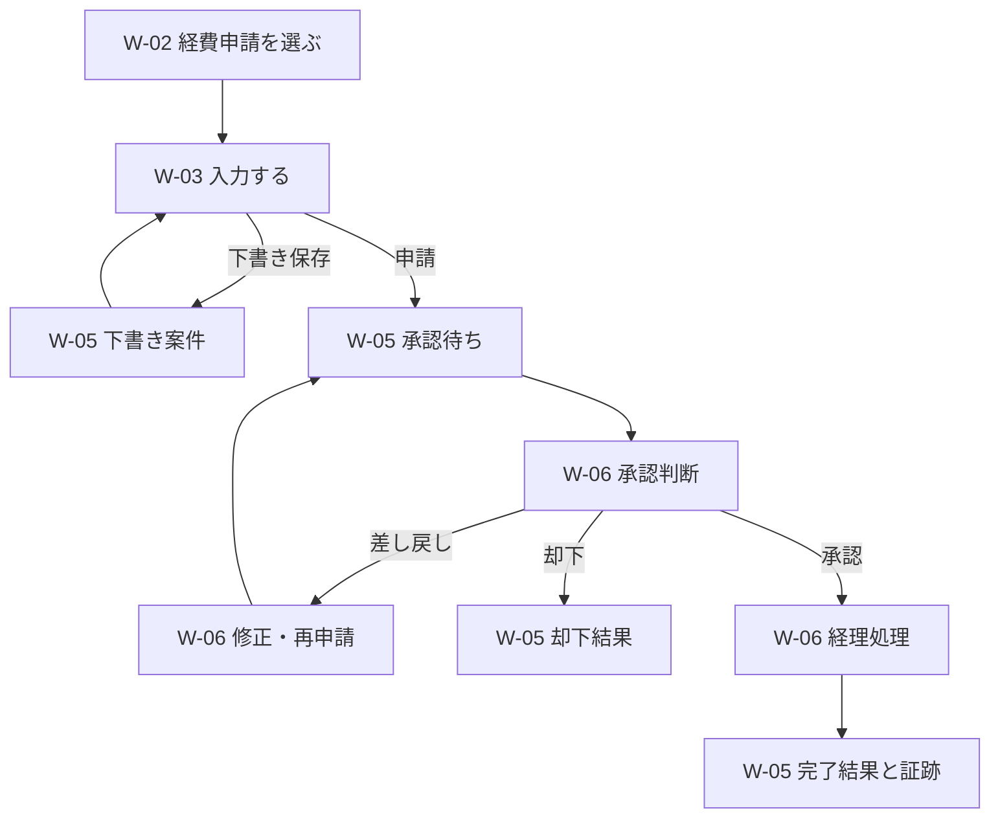

# ネイティブ業務実行の画面とユーザーフロー

## 1. 文書情報

| 項目 | 内容 |
|---|---|
| 文書状態 | W-01〜W-06初回実装反映済み |
| 対象 | 案件、作業、承認、期限、証跡を扱う組織別SPA |
| 設計レベル | 画面、route、状態、権限、ユーザーフロー |
| 最終更新日 | 2026-08-10 |

この文書は、[ネイティブ業務ワークフロー設計](native-business-workflows.md)を利用者が操作できる
画面へ展開します。最初の実装対象は、既存の経費精算サンプルを、外部APIなしで申請開始から
承認、差し戻し、再申請、経理処理、完了まで進める体験です。

現行の業務知識と変更フローは
[MVP画面構成とユーザーフロー](screens-and-user-flow.md)を正本として維持します。この文書では、
その画面を業務実行のアプリケーションシェルからどう利用するかだけを追加で定義します。

## 2. 画面設計の判断

### 2.1 日常業務と設計業務を分ける

日常利用者が最初に見るのはBusiness Graphやworkflow editorではなく、自分の作業、承認、
差し戻し、期限、案件です。業務知識は案件の背景と判断根拠として参照し、業務設計は権限のある
利用者だけが別の入口から操作します。

| 体験 | 主な利用者 | 主な画面 | 目的 |
|---|---|---|---|
| 業務実行 | 申請者、担当者、承認者、業務責任者 | W-01〜W-06 | 案件を開始し、自分の操作を完了する |
| 業務理解 | 全利用者 | 現行S-01、S-02 | rule、文書、役割、system、前後工程を理解する |
| 業務変更 | 業務設計者、公開責任者 | 現行S-03〜S-05、将来W-10〜W-12 | 知識と実行定義を安全に変更する |
| 組織・連携設定 | ownerと委任された管理者 | 将来W-13、W-14 | 担当割当とConnectorを管理する |

### 2.2 案件を操作の文脈にする

承認、差し戻し、経理処理を別々の製品のように分断しません。すべての作業は案件詳細の
共通shellを使い、作業対象、申請内容、現在地、次の担当、期限、適用rule、過去の判断、Activityを
同じ文脈で確認できるようにします。

作業を直接開くrouteは持ちますが、単独のタスク詳細画面にはせず、案件の見出しと進行状況を
常に表示します。ホーム、通知、案件一覧から同じ作業routeへdeep linkします。

### 2.3 最初から汎用builderを要求しない

次期MVPでは完成済みの「経費申請」templateを業務カタログへ表示します。利用者は定義を
作成せずに案件を開始できます。汎用visual builder、任意の式、外部action設定は後続画面とし、
業務実行画面の成立条件にしません。

## 3. アプリケーションシェルとナビゲーション

`/organizations/[organizationSlug]/layout.tsx`を組織別SPAの共通shellとして維持し、サイドバー、
組織、利用者、アクセス権限をroute間で共有します。主ナビゲーションは責務ごとに次の構成へ
分けます。

| ナビゲーション | route | 表示対象 | 実装段階 |
|---|---|---|---|
| ダッシュボード | `/organizations/<organizationSlug>` | 全利用者 | 初回実装済み |
| 業務を開始 | `/organizations/<organizationSlug>/workflows` | 開始可能な業務がある利用者 | 初回実装済み |
| 自分の案件 | `/organizations/<organizationSlug>/cases` | 全利用者 | 初回実装済み |
| 規定・文書 | `/organizations/<organizationSlug>/documents`と既存の`/entities/<businessEntityId>` | 全利用者 | 実装済み |
| コミュニケーション | `/organizations/<organizationSlug>/communication` | 全利用者 | 初回実装済み |
| 業務データ | `/organizations/<organizationSlug>/records` | recordの参照権限がある利用者 | 後続 |
| 業務設計 | `/organizations/<organizationSlug>/workflow-definitions` | 業務設計者、公開責任者 | 後続 |

「設定」は主ナビゲーションと同じ強さで置かず、ヘッダーの組織メニューから開きます。
外部連携を導入した後も、Integration設定を日常業務の完了導線には置きません。

狭い画面では主ナビゲーションを画面上部へ移し、区分ごとのリンクを横方向に表示します。
次期MVPの必須検証環境は現行要件どおり一般的なデスクトップですが、承認と短いコメントは
狭い画面でも横スクロールなしで操作できる構造にします。

## 4. routeと状態の置き場所

### 4.1 次期MVPのroute

| 表示 | route | URLで復元するもの |
|---|---|---|
| ホーム | `/organizations/<organizationSlug>` | 組織と利用者別の業務サマリー |
| 業務カタログ | `/organizations/<organizationSlug>/workflows` | 組織で公開中の開始可能なworkflow |
| 業務開始 | `/organizations/<organizationSlug>/workflows/<workflowDefinitionId>/start` | 開始対象のworkflowと公開version |
| 案件一覧 | `/organizations/<organizationSlug>/cases` | 組織と、search paramsで表す絞り込み |
| 案件詳細 | `/organizations/<organizationSlug>/cases/<caseId>` | 案件と現在状態 |
| 作業実行 | `/organizations/<organizationSlug>/cases/<caseId>/work-items/<workItemId>` | 案件と操作対象の作業 |
| 規定・文書 | `/organizations/<organizationSlug>/documents` | 組織とナレッジ分類 |
| コミュニケーション | `/organizations/<organizationSlug>/communication?channel=<channelId>` | 組織と選択中チャンネル |

現行の`/entities/<businessEntityId>`と`/changes/<changeSetId>`は変更しません。組織routeの入口だけを
経費申請の業務知識からW-01ホームへ変更し、業務知識は主ナビゲーションと案件内linkから開きます。

### 4.2 状態管理

- 案件、作業、承認、判断、コメント、証跡、Activityはサーバーの正規データとして保存する。
- W-03でまだ保存していない入力と、確認dialogを開いている状態だけをClient stateに持つ。
- W-03で「下書き保存」した時点で`Case.DRAFT`を作成し、W-05へ移動する。
- 案件一覧の状態、業務、期限、担当の絞り込みはsearch paramsに持ち、URL共有と戻る操作で復元する。
- 案件詳細内の補助tabはsearch paramsに持てるが、現在のstepや作業状態をtabで表現しない。
- 更新前に案件と作業のversionまたは更新時刻を検証し、古い画面からの二重判断を拒否する。

## 5. 画面一覧

### 5.1 全体一覧

| ID | 画面 | 主な利用者 | 実装段階 | 目的 |
|---|---|---|---|---|
| W-01 | ホーム | 全利用者 | 初回実装済み | 自分が今行うことと、注意が必要な案件を把握する |
| W-02 | 業務カタログ | 申請者、依頼者 | 初回実装済み | 開始権限のある業務を探す |
| W-03 | 業務開始・申請入力 | 申請者、依頼者 | 初回実装済み | 必要情報を入力し、下書き保存または申請する |
| W-04 | 案件一覧 | 全利用者、業務責任者 | 初回実装済み | 権限範囲の案件を状態、業務、担当、期限から探す |
| W-05 | 案件詳細 | 案件関係者、参照者 | 初回実装済み | 現在地、入力、担当、判断、証跡、Activityを確認する |
| W-06 | 作業実行 | 担当者、承認者、差し戻しを受けた申請者 | 初回実装済み | 案件の文脈内で一つの作業または判断を完了する |
| W-07 | 業務データ一覧 | 担当者、参照者 | 後続 | 顧客、取引先、契約、請求、資産などを横断して探す |
| W-08 | 業務データ詳細 | 担当者、参照者 | 後続 | recordの現在値、関連案件、証跡を確認する |
| W-09 | 業務定義一覧・詳細 | 業務設計者、公開責任者 | 後続 | 公開中versionとdraft、関連PROCESSを確認する |
| W-10 | 業務定義編集 | 業務設計者 | 後続 | 入力、step、担当rule、期限、関連知識を変更する |
| W-11 | 業務定義レビュー | 業務設計者、reviewer | 後続 | 定義差分と影響候補を確認し、reviewを記録する |
| W-12 | 業務定義公開結果 | 公開責任者 | 後続 | 新versionの公開結果と適用範囲を確認する |
| W-13 | 組織・業務担当設定 | owner、委任された管理者 | 実装方法決定後 | membershipと業務上の役割、代理を設定する |
| W-14 | Integration設定 | owner、委任された管理者 | 外部連携段階 | Connector、mapping、同期状態を管理する |
| C-01 | コミュニケーション | 全利用者 | 初回実装済み | 組織内チャンネルで相談し、案件を共有する |

W-07以降も到達点には必要ですが、最初の経費申請を完了するための実装範囲には含めません。
ただしW-13で扱う承認者と経理担当の割当は実行に必要なため、次期MVPではseedまたは実装前に
確定する最小設定方式で準備し、画面を先に作ることを開始条件にはしません。

C-01のチャンネル、投稿、案件共有、外部連携境界は
[ネイティブコミュニケーション設計](native-communication.md)を正本とします。

### 5.2 W-01 ホーム

ホームは集計dashboardではなく、利用者が次の行動を選ぶためのinboxです。次の順で表示します。

1. 自分の対応待ち: 作業、承認、差し戻し。期限超過、当日期限、通常の順で並べる。
2. 注意が必要: 自分が開始した差し戻し案件、待機、処理失敗、期限超過。
3. 最近の案件: 自分が開始、担当、判断した案件。
4. 業務を開始: 開始可能な経費申請への主要CTA。

各項目は案件名、案件番号、現在step、自分に必要な操作、期限、依頼者を表示し、W-06または
W-05へ直接移動します。件数だけのカードを並べず、最低一つの具体的な次の行動を画面内に
表示します。対象がない場合は「現在対応が必要な業務はありません」と、W-02への導線を示します。

### 5.3 W-02 業務カタログ

- 公開済みで、利用者に開始権限がある`WorkflowDefinition`だけを表示する。
- 名称、説明、関連PROCESSを対象に検索できるようにする。
- 各業務に、何を完了できるか、必要な主な入力、標準的な担当、目安の所要期間を表示する。
- 次期MVPでは「経費申請」一件でも空の一覧に見せず、完成済みtemplateとして説明する。
- 業務を選ぶとW-03へ移動する。定義編集や外部サービス接続を開始条件にしない。

### 5.4 W-03 業務開始・申請入力

経費申請では、少なくとも経費発生日、金額、用途、支払先、領収書情報を構造化入力として
扱います。入力項目の近くから、領収書提出ルール、金額別承認ルール、経費規程を参照できます。

| 領域 | 主な内容 |
|---|---|
| 見出し | 業務名、説明、適用workflow version |
| 入力 | 必須表示、型に応じた入力、項目単位の検証結果 |
| 証憑 | 領収書情報。ファイル添付を初回へ含めるかは保存方式の決定に従う |
| 根拠 | 関連rule、文書、問い合わせ先 |
| 操作 | キャンセル、下書き保存、申請 |

「申請」では、検証結果、次の担当候補、適用した主なruleを確認してから確定します。確定後は
`Case.RUNNING`と最初の`WorkItem`を作成し、W-05へ移動します。適格な承認者がいない場合は
案件を曖昧な状態で開始せず、設定不足と必要な対応を表示します。

### 5.5 W-04 案件一覧

- 既定は「自分の案件」とし、自分が開始、担当、承認、代理した案件を表示する。
- 状態、業務、担当、期限、開始日で絞り込めるようにする。
- 状態は「下書き」「対応中」「待機中」「完了」「却下」「取消」「処理失敗」の利用者向け表記にする。
- 各行に案件番号、業務名、申請者、現在step、次の担当、期限、最終更新を表示する。
- 業務責任者には権限範囲の案件を表示する切り替えを提供する。
- bulk更新、自由なcolumn editor、集計reportは次期MVPに含めない。

検索結果がない場合は絞り込み解除を提示し、案件自体がない場合はW-02への導線を表示します。

### 5.6 W-05 案件詳細

案件詳細は、状態にかかわらず同じ情報構造を維持します。

| 領域 | 主な内容 |
|---|---|
| 案件ヘッダー | 案件番号、業務名、状態、開始者、開始日時、workflow version |
| 現在地 | 完了済みstep、現在step、後続step、条件分岐の理由 |
| 次の行動 | 操作者、操作内容、期限。自分の作業がある場合はW-06への主要CTA |
| 申請・処理内容 | 構造化した`CaseData`、判断時点の値、処理結果 |
| 担当と判断 | 現在と過去の担当、承認結果、理由、代理関係 |
| 証跡と連絡 | `Artifact`、案件内コメント、手動処理の記録 |
| 関連知識 | PROCESS、RULE、DOCUMENT、ROLE、SYSTEMへのlink |
| Activity | 開始、入力、割当、判断、差し戻し、再申請、完了の時系列 |

完了、却下、取消後も同じrouteで再表示します。終端状態では次の担当欄を結果要約へ切り替え、
完了結果、終了理由、完了者、完了日時、適用version、証跡を上部で確認できるようにします。

申請者は承認前の許可された時点で取下げできます。取下げ可能かは状態とruleで判断し、
操作を表示しないだけでなく、できない理由を確認できるようにします。

### 5.7 W-06 作業実行

W-06は`WorkItem`の種類に応じて操作領域を切り替え、案件の共通情報はW-05と同じshellで
表示します。割当対象でない利用者がURLを開いた場合は、許可された案件情報だけを読み取り専用で
表示し、判断用の操作は返しません。

| 作業種別 | 必須表示 | 主な操作 |
|---|---|---|
| 入力・再申請 | 現在値、差し戻し理由、不足項目、関連rule | 修正を保存、再申請 |
| 承認 | 申請内容、証憑、適用rule、経路、過去の判断、申請者との関係 | 承認、差し戻し、却下 |
| 経理処理 | 承認結果、領収書情報、確認事項、支払処理欄、必要な証跡 | 処理中保存、完了 |
| 一般作業 | 作業指示、完了条件、期限、関連入力 | 着手、結果保存、完了 |
| 業務データ更新 | 対象record、変更前後、関連案件、更新条件 | 作成または更新、完了 |
| 連絡 | 宛先、本文、関連案件、review状態、配送状態 | 下書き保存、review依頼、送信確定 |
| 予定 | 日時、参加者、場所、関連案件、重複や制約 | 下書き保存、確認、予定確定 |

差し戻しと却下は理由を必須とし、承認理由は任意入力にします。経理処理の完了では、処理日、
処理結果、参照番号または手動処理の証跡を記録します。保存処理中は二重送信を防ぎ、競合時は
最新状態と自分の未送信入力を区別して再確認できるようにします。

承認、差し戻し、却下の確認はdialogで行えますが、判断に必要な情報をdialogへ再構成しません。
利用者は背景情報をW-06本体で確認し、dialogでは実行する判断と理由だけを最終確認します。

業務データ更新、連絡、予定は後続段階で追加しますが、provider固有の操作画面は作りません。
外部Connectorがある場合も、同じW-06でネイティブな入力とreviewを確定し、外部同期状態だけを
補足表示します。

### 5.8 ネイティブ資源と画面の対応

将来のAPIまたはConnectorが読み書きする資源も、先にアプリ内で次の操作場所を持ちます。

| ネイティブ資源 | 主な作成・操作画面 | 主な参照画面 |
|---|---|---|
| `Case` | W-03、W-05 | W-01、W-04、W-05 |
| `CaseData` | W-03、W-06 | W-05、W-06 |
| `WorkItem` | workflow遷移により作成、W-06で実行 | W-01、W-04、W-05 |
| `Approval` / `Decision` | W-06 | W-05、W-06 |
| `Artifact` | W-03、W-06 | W-05、W-06 |
| `Comment` | W-05、W-06 | W-05 |
| `Communication` | C-01チャンネル、メッセージ、案件共有 | C-01、共有先のW-05 |
| `ScheduleEntry` | 後続のW-06予定作業 | W-01、W-05、W-06 |
| `Activity` | 各更新から自動記録 | W-05 |
| `Notification` | 各遷移から自動作成 | W-01、対象のW-05またはW-06 |
| `BusinessRecord` | 後続のW-06業務データ更新 | W-07、W-08、関連するW-05 |
| `BusinessEntity` / `Relation` | 現行S-03〜S-05 | 現行S-01、S-02、関連するW-03〜W-06 |

この対応により、外部連携は新しい業務体験を別に作るのではなく、既存画面への入力、配送、同期を
省力化する境界になります。Connectorを無効にしても、手動入力とアプリ内記録で案件を継続できる
必要があります。

## 6. 次期MVPの経費申請フロー

### 6.1 申請者

1. W-01またはW-02から経費申請を選ぶ。
2. W-03で入力し、必要なら下書きを保存する。
3. 申請後はW-05で現在地、承認者、期限を確認する。
4. 差し戻された場合はW-01からW-06を開き、理由を見ながら修正して再申請する。
5. 完了、却下、取消後もW-05で結果と証跡を確認する。

### 6.2 承認者

1. W-01の「自分の対応待ち」から承認対象のW-06を開く。
2. 申請内容、証憑、適用rule、経路、過去の判断を一画面で確認する。
3. 承認、差し戻し、却下のいずれかを選び、必要な理由を記録する。
4. 確定後はW-05で案件の次のstepと自分の判断が記録されたことを確認する。

### 6.3 経理担当

1. 承認済み案件のW-06をW-01から開く。
2. 申請内容、承認結果、領収書情報を確認する。
3. 支払または精算処理の結果と証跡を記録する。
4. 作業を完了し、W-05で案件が完了状態になったことを確認する。

## 7. 権限と表示

| 操作 | 申請者 | 割当担当者 | 承認者 | 業務責任者 | viewer |
|---|---|---|---|---|---|
| 開始可能な業務を見る | 開始権限がある場合 | 開始権限がある場合 | 開始権限がある場合 | 可 | 不可 |
| 自分の案件を見る | 可 | 関係案件のみ | 関係案件のみ | 権限範囲 | 組織方針で許可された範囲 |
| 作業を完了する | 差し戻し対応のみ | 自分または有効な代理割当のみ | 不可 | 再割当後のみ | 不可 |
| 承認判断する | 自己承認不可 | 承認割当がある場合のみ | 自分または有効な代理割当のみ | 承認割当がある場合のみ | 不可 |
| 再割当・例外解消 | 不可 | 不可 | 不可 | 可 | 不可 |
| 業務知識を見る | 可 | 可 | 可 | 可 | 可 |

membership role、Business Graphの`ROLE`、`BusinessRoleAssignment`、個別`WorkItem`の割当は
別々に検証します。画面に操作を表示する条件と、Server Actionで許可する条件を同じpolicyから
導出し、URLやrequest値だけで権限を判断しません。

## 8. dialogと補助状態

| ID | 種類 | 表示条件 | 必要な操作 |
|---|---|---|---|
| WD-01 | 未保存入力の破棄確認 | W-03またはW-06で未保存入力を残して移動する | 編集を続ける、破棄して移動する |
| WD-02 | 申請確認 | W-03で申請する | 入力、次の担当候補、主なruleを確認して申請する |
| WD-03 | 判断確認 | W-06で承認、差し戻し、却下する | 判断種別と理由を確認して確定する |
| WD-04 | 取下げ確認 | 許可された申請者が実行中案件を取り下げる | 続行する、取消状態へ進める |
| WD-05 | 作業完了確認 | 経理担当者が案件を終端へ進める | 処理結果と証跡を確認して完了する |
| WA-01 | 入力エラー | 必須、型、ruleの検証に失敗する | 該当項目を修正する |
| WA-02 | 競合 | 表示後に案件または作業が更新された | 最新状態を読み、未送信入力を再確認する |
| WA-03 | 設定不足 | 適格な担当者、承認者、公開versionがない | 開始せず、業務責任者または管理者へ対応を示す |
| WA-04 | 期限超過 | WorkItemが期限を過ぎて未完了 | 期限超過として操作を継続し、Activityへ記録する |
| WA-05 | 待機 | 案件が日時、他案件、手作業の完了を待つ | 待機理由と再開条件を表示する |
| WA-06 | 取得・更新失敗 | サーバー処理が失敗する | 入力を保持して再試行する |
| WA-07 | 権限不足 | 許可されない案件または操作を要求する | 更新せず、許可された一覧へ戻る |

期限超過、差し戻し、待機、設定不足は一般的なシステムエラーの画面へ送らず、業務上の状態として
案件内に表示します。存在しないIDと組織外のIDは情報を漏らさない同じNot Found応答にします。

## 9. アクセシビリティと操作規則

- ホームの作業、案件一覧、案件詳細、判断操作をキーボードだけで完了できるようにする。
- 状態、期限超過、承認結果を色だけで区別せず、文字とiconまたは形を併用する。
- 画面遷移後は主見出し、判断確定後は結果要約へfocusを移す。
- dialogではfocusを内部へ閉じ、閉じた後は操作元へ戻す。
- 非同期保存、競合、検証結果を支援技術へ通知する。
- 金額と日付は表示localeを統一し、保存値と表示値を混同しない。
- Activityは視覚的なtimelineだけに依存せず、時刻、主体、操作、結果を文章でも読めるようにする。

## 10. 次期MVPで作らない画面

最初の経費申請では、次を独立画面として作りません。

- タスク専用のkanbanまたはproject board
- 承認だけを集めた別製品型のinbox。W-01とW-04の絞り込みで扱う
- 案件の進捗だけを表示する独立画面。W-05へ集約する
- 汎用visual workflow builderと任意の条件式editor
- 業務データ、組織階層、代理、営業日calendarの管理画面
- 外部SaaS、MCP、Webhook、メール、calendarの接続画面
- AI生成、AI判断、送信reviewの専用画面
- 全組織横断の監査log、保持期間、exportの管理画面
- 通知専用画面。W-01と案件内Activityを先に使う

これらを作らなくても、W-01〜W-06、規定・文書、C-01コミュニケーションで、経費申請を開始から完了まで
アプリ内で処理できることを次期MVPの画面完成条件とします。

## 11. 画面受け入れ条件

1. 申請者がW-02から経費申請を選び、W-03で下書き保存または申請できる。
2. 申請後、W-05で現在地、次の担当、期限、適用versionを説明できる。
3. 承認者がW-06だけで、申請内容、証憑、rule、過去の判断を確認して判断できる。
4. 差し戻し理由を見た申請者が修正し、同じ案件として再申請できる。
5. 経理担当者が処理結果と証跡を記録し、案件を完了できる。
6. 完了、却下、取消後もW-05のURLから結果、判断理由、Activityを再表示できる。
7. 各利用者がW-01から自分の次の行動へ一回の選択で移動できる。
8. 関連するPROCESS、RULE、DOCUMENT、ROLEを案件から既存の業務知識画面で確認できる。
9. 権限のない利用者は、画面表示とServer Actionのどちらからも判断や完了操作を実行できない。
10. 外部APIまたはConnectorがなくても、上記の中核フローを完了できる。
11. C-01でチャンネルを作成し、案件付きメッセージを投稿してW-05へ戻れる。

## 12. 初回実装で確定した判断

- 固定サンプルは一人の認証済みmemberへ申請者、承認者、経理担当を割り当てる。実利用者IDと
  業務役割はWorkItemとActivityで分けて保存し、W-13の再割当へ移行できるようにする。
- 初回は領収書ファイル本体を保存せず、領収書番号などの参照情報を必須の構造化項目として扱う。
- 期限はWorkItem作成時刻からの暦日で計算し、BusinessCalendarは後続とする。
- Activityは案件画面の利用者向け履歴として保存し、改変防止を考慮したAuditEventは後続とする。
- ownerとeditorは更新操作、viewerは参照だけを行える。各Server Actionでsession、membership、
  organization、担当WorkItemを再検証する。
- W-04は初回サンプルでは開始者本人の案件を表示する。関係者全員や業務責任者の絞り込みは、
  複数memberと業務役割割当を導入するときに追加する。
