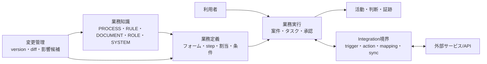
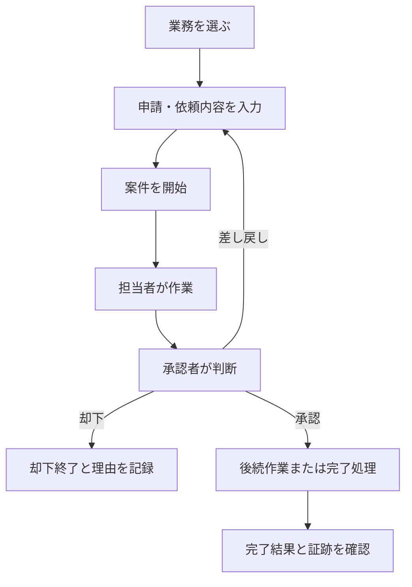

# ネイティブ業務ワークフロー設計

## 1. 文書情報

| 項目 | 内容 |
|---|---|
| 文書状態 | 方針確定・実装前 |
| 対象 | 日本企業向けの業務実行基盤と、現行MVPからの次段階 |
| 設計レベル | プロダクト・論理ドメイン設計 |
| 最終更新日 | 2026-08-10 |

この文書は、`process-diff-mvp`を業務知識の参照と変更だけでなく、申請、作業、承認、確認、
完了までをアプリ内で実行できるプロダクトへ発展させる方針を定義します。外部API連携の
実装方式ではなく、APIの有無にかかわらずアプリが自ら保持する業務概念と体験を正本とします。

現行MVPの業務知識ワークスペース、Business Graph、差分、影響候補、組織分離は廃止しません。
これらを、実行する業務の定義と変更を安全に管理する層として再配置します。

## 2. 設計判断の要約

### 2.1 プロダクトの到達点

利用者は、外部サービスを渡り歩かなくても、次の一連の業務をこのアプリで完了できます。

1. 自分が開始できる業務を選ぶ
2. 必要な情報と証憑を入力して申請または依頼を開始する
3. 担当者が作業し、承認者が判断する
4. 差し戻し、再申請、代理対応、期限超過などの例外を処理する
5. 完了結果、判断理由、証跡を一つの案件として確認する
6. 業務ルールや手順を変更するときは、差分と影響範囲を確認して新しい版を公開する

外部APIは、メール、カレンダー、会計、CRM、文書管理などとの入出力を自動化するための
追加手段です。接続先がなくても、手動開始、アプリ内入力、タスク、承認、通知、完了記録により
業務を成立させます。

### 2.2 設計原則

- **Native first**: 業務の状態、担当、判断、期限、証跡はアプリ自身の正規データとして持つ。
- **Integration optional**: 外部接続は業務を成立させる前提にせず、入力と出力を省力化する。
- **One place to finish work**: 外部サービスへのリンク集ではなく、利用者が次の行動を完了できる画面を持つ。
- **Human accountable**: AIは分類、要約、候補作成を支援しても、承認や重要な確定判断の責任主体にしない。
- **Versioned operation**: 業務定義を版管理し、実行中の案件がどの版に従ったかを再現できるようにする。
- **Explainable change**: 業務定義の変更は、差分、変更理由、影響候補、公開者を確認できるようにする。
- **Japanese enterprise ready**: 稟議的な多段承認だけに限定せず、差し戻し、代理、兼務、部門、金額条件、
  営業日、証跡、職務分離を最初から論理モデルに含める。

## 3. 参照したパターンと本プロジェクトでの適用

[this+that Workflows](https://www.thisandthat.chat/workflows/)は、2026-08-10時点で、単一目的の
`flow`をトリガーと複数stepから構成し、複数flowを一つの目的を持つ`workflow`へ束ねています。
メッセージ、時刻、タスク作成を開始条件とし、分類、条件分岐、タスク作成、返信案、通知、
カレンダー操作などをstepとして扱い、外部ツールはMCP経由で接続する構成です。

本プロジェクトでは、次の抽象だけを参考にします。

| 参照パターン | 本プロジェクトでの適用 |
|---|---|
| トリガーから複数stepを実行する | 一つの業務案件を開始し、入力、作業、承認、完了まで進める |
| 条件分岐とAIによる判断支援 | 金額、部門、申請種別などの決定的なruleと、AIの候補提示を分離する |
| タスク、通知、予定、文書をactionとして扱う | まずアプリ内のタスク、通知、期限、記録をネイティブactionとして実装する |
| review前提のaction | 重要な送信、承認、外部更新は人が内容を確認して確定する |
| 複数flowを一つの目的に束ねる | 一つの業務を複数の工程または下位業務へ分割できるようにする |
| API/MCPで任意ツールへ接続する | Connectorを境界にし、ネイティブドメインを外部サービスのデータ形式へ従属させない |

メール中心の体験、外部サービスを操作すること自体、ノーコード生成はそのまま採用しません。
日本企業の組織内業務を完了するために必要な担当、承認、期限、例外、証跡を優先します。

## 4. プロダクトの論理構造

### 4.1 業務知識層

現行の`BusinessEntity`と`Relation`を使い、「この業務は何か」「どのrule、文書、役割、
systemと関係するか」を表します。通常利用で業務の背景と根拠を理解する層です。

### 4.2 業務定義層

業務を実行可能にするため、開始条件、入力項目、step、担当決定、承認条件、期限、完了条件を
版管理された定義として持ちます。`PROCESS`は業務の意味を表すnodeとして維持し、実行仕様である
`WorkflowDefinition`とは分けて関連付けます。

### 4.3 業務実行層

定義から開始された一回の業務を`Case`として扱います。利用者が日常的に操作する中心は、
Business Graphそのものではなく、自分の案件、担当タスク、承認待ち、期限、完了結果です。

### 4.4 変更管理層

現行の差分と影響候補を、知識本文だけでなく業務定義の変更にも適用します。公開済み定義を
直接上書きせず、変更案を作成し、差分と影響を確認して新しいversionとして公開します。

### 4.5 Integration層

外部イベントを開始条件へ変換し、ネイティブactionの結果を外部サービスへ反映する境界です。
Connectorの失敗や停止で案件全体の正規状態を失わないよう、実行状態と外部同期状態を分けます。

## 5. 利用者と責務

| 利用者 | 主な責務 |
|---|---|
| 申請者・依頼者 | 業務を開始し、必要情報を入力し、差し戻しへ対応する |
| 担当者 | 割り当てられた作業を実施し、結果と証跡を記録する |
| 承認者 | 判断対象、根拠、過去の判断を確認し、承認、却下、差し戻しを行う |
| 業務責任者 | 業務の滞留、例外、期限超過を把握し、再割当やエスカレーションを行う |
| 業務設計者 | 業務定義、フォーム、条件、担当rule、関連知識の変更案を作成する |
| 公開責任者 | 業務定義の差分と影響を確認し、新しいversionを公開する |
| 監査・参照者 | 権限範囲内の案件、判断、変更、証跡を参照する |

現行のmembership roleである`owner`、`editor`、`viewer`は組織workspaceへの粗いアクセス権限です。
上表の業務上の責務、`BusinessEntity`の`ROLE`、個別案件の担当を同じrole列へ統合しません。

## 6. ネイティブに扱うドメイン

### 6.1 定義

| 概念 | 責務 |
|---|---|
| `WorkflowDefinition` | 一つの業務目的と、関連する`PROCESS`を示す |
| `WorkflowVersion` | 公開時点の実行仕様を不変の版として保持する |
| `StepDefinition` | 入力、作業、承認、分岐、待機、通知、下位業務、完了を表す |
| `TransitionDefinition` | step間の遷移と、遷移可能な条件を表す |
| `FormDefinition` / `FieldDefinition` | 開始時またはstep完了時に必要な構造化入力を表す |
| `RecordTypeDefinition` | 顧客、取引先、契約、請求、資産など再利用する業務recordの型を表す |
| `AssignmentRule` | 個人、部門、役割、申請者の上長などから担当候補を決める |
| `ApprovalRule` | 直列、並列、全員、いずれか一人、却下・差し戻し時の扱いを決める |
| `DueRule` | 日数、営業日、基準日時、猶予、エスカレーションを決める |
| `PolicyBinding` | `RULE`、`DOCUMENT`、`ROLE`、`SYSTEM`を定義またはstepへ関連付ける |

### 6.2 実行

| 概念 | 責務 |
|---|---|
| `Case` | 一回開始された業務と、その現在状態、開始者、適用versionを表す |
| `CaseData` | フォーム入力と業務処理で確定した構造化値を表す |
| `BusinessRecord` | 案件をまたいで参照する顧客、取引先、契約、請求、資産などを表す |
| `WorkItem` | 人が行う一つの作業、担当、期限、完了条件を表す |
| `Approval` | 承認対象、承認者、方式、判断、理由を表す |
| `Decision` | 承認以外を含む人またはruleの判断結果と根拠を表す |
| `Artifact` | 添付、証憑、生成文書、外部参照を案件へ関連付ける |
| `Comment` | 案件またはstepの文脈に沿った連絡を保持する |
| `Communication` | 宛先、本文、配送手段、review、送受信結果を案件の文脈で表す |
| `ScheduleEntry` | 会議、訪問、予約、作業予定と参加者を表す |
| `Activity` | 開始、割当、入力、判断、遷移、通知、例外対応を時系列で記録する |
| `AuditEvent` | 重要操作の主体、対象、前後状態、権限文脈を改変防止を考慮して記録する |
| `Notification` | アプリ内で誰へ何を通知し、既読かを表す |

`CaseData`は汎用JSONだけに閉じ込めず、どの`FieldDefinition`とversionに基づく値かを追跡します。
金額、日付、組織、利用者、選択肢などは型を持ち、条件判定と表示で同じ意味を再利用します。

### 6.3 組織と時間

| 概念 | 責務 |
|---|---|
| `OrganizationUnit` | 法人、事業部、部、課などの所属階層を表す |
| `Position` | 上長判定や職位条件に使う職位を表す |
| `BusinessRoleAssignment` | 利用者が期間付きで担う業務上の役割を表す |
| `Delegation` | 代理期間、対象業務、委任元と委任先を表す |
| `BusinessCalendar` | 休日、営業日、締め時刻、timezoneを表す |

組織改編や人事異動後も過去の判断を説明できるよう、案件開始時または割当時に用いた所属、
役割、割当ruleの評価結果を履歴として残します。

## 7. Workflowの実行意味

### 7.1 開始条件

ネイティブtriggerは、段階的に次を扱える設計にします。

- 利用者がworkflow catalogから手動で開始する
- 既存案件のstepから下位業務を開始する
- 指定日時または繰り返しscheduleから開始する

最初の経費申請実装は利用者による手動開始だけを対象とし、下位業務とscheduleは後続段階で
追加します。

外部イベント、Webhook、メール受信、外部レコード更新は将来のintegration triggerです。
外部triggerも最終的には、検証済みの開始者、重複排除key、受信内容を持つ`Case`開始要求へ
正規化します。

### 7.2 Stepの種類

| 種類 | 意味 |
|---|---|
| `INPUT` | 利用者から構造化情報を受け取る |
| `TASK` | 担当者が作業し、結果を記録する |
| `APPROVAL` | 一人以上が承認、却下、差し戻しを判断する |
| `CONDITION` | 確定値とruleから次の経路を決める |
| `WAIT` | 日時、期限、別案件の完了まで待つ |
| `RECORD` | ネイティブな業務recordを作成または更新する |
| `COMMUNICATION` | アプリ内の連絡を作成し、必要なら送信reviewを要求する |
| `SCHEDULE` | 会議、訪問、予約、作業予定を作成または更新する |
| `NOTIFICATION` | アプリ内通知を作成する |
| `SUBFLOW` | 別のworkflowを開始し、必要なら完了を待つ |
| `END` | 案件を完了、却下終了、取消終了のいずれかへ確定する |

外部API呼び出しはStepの中核種別ではなく、将来の`INTEGRATION_ACTION`として追加します。
同じ目的をネイティブstepで実行できる場合は、Connectorなしでも業務を継続できます。

### 7.3 条件と判断

- 金額、部門、申請区分など再現性が必要な分岐は明示的なruleで評価する。
- AIの分類や抽出は、入力候補、担当候補、要約などの支援結果として保存する。
- AIの結果には根拠、利用モデル、生成日時、確認状態を持たせる。
- AIだけで承認、却下、金銭支出、対外送信を確定しない。
- 条件評価時の入力値とrule versionをActivityへ記録し、後から経路を説明できるようにする。

### 7.4 状態

`WorkflowVersion`は`DRAFT`、`IN_REVIEW`、`PUBLISHED`、`RETIRED`を持ちます。公開済みversionは
不変とし、変更は新しいdraftとして作成します。

`Case`は少なくとも`DRAFT`、`RUNNING`、`WAITING`、`COMPLETED`、`REJECTED`、`CANCELLED`、
`FAILED`を持ちます。`WAITING`では待機理由と再開条件を必須にします。

`WorkItem`は`READY`、`IN_PROGRESS`、`COMPLETED`、`RETURNED`、`CANCELLED`、`SKIPPED`を
持ちます。誰が、どの権限と代理関係で状態を変えたかを記録します。

`Approval`は少なくとも`PENDING`、`APPROVED`、`REJECTED`、`RETURNED`、`CANCELLED`を持ち、
複数承認者がいる場合は個々の判断とstep全体の集約結果を分けます。

### 7.5 公開済み定義と実行中案件

- 新しい案件は、開始時点の`PUBLISHED` versionへ固定する。
- 定義の新versionを公開しても、実行中案件を暗黙に移行しない。
- 緊急変更で実行中案件の移行が必要な場合は、対象案件、変換内容、実行者を明示した別操作にする。
- 廃止済みversionの案件も、完了または保存期限まで参照できるようにする。

## 8. 日本企業向けの業務要件

### 8.1 申請と承認

- 下書き、申請、取下げ、承認、却下、差し戻し、再申請を区別する。
- 直列承認、並列承認、全員承認、いずれか一人の承認を表現できるようにする。
- 金額、部門、申請種別、職位、法人などから承認経路を決定できるようにする。
- 承認者不在時の代理と、業務責任者による再割当を履歴付きで扱う。
- 申請者と最終承認者を同一人物にしないなど、職務分離の制約を定義できるようにする。
- 承認画面では、申請内容、添付、適用rule、過去の判断、現在地を一画面で確認できるようにする。

### 8.2 期限と例外

- 暦日と営業日を区別し、組織の休日とtimezoneを考慮する。
- 期限前通知、期限超過、段階的エスカレーションを別のActivityとして扱う。
- 担当者不在、入力不足、外部同期失敗、条件不成立を、単なるシステムエラーと混同しない。
- 例外を解消した人、理由、再開したstepを記録する。
- 手作業へ切り替えた場合も、結果をアプリへ戻して案件を完了できるようにする。

### 8.3 証跡と情報管理

- 表示用のタイムラインと、改変防止を考慮した監査イベントを論理的に分ける。
- 誰が、いつ、どの組織・代理関係で、何を見て、何を判断したかを再現可能にする。
- コメントの編集履歴、添付のversion、削除または保持期限を追跡できるようにする。
- 個人情報や機密情報は、案件、項目、添付の性質に応じて閲覧範囲を制限できるようにする。
- 監査対応をうたう段階では、保持期間、export、時刻同期、管理者操作の記録を別途受け入れ検証する。

## 9. IntegrationとAPIの境界

### 9.1 APIが扱うもの

将来のAPIとConnectorは、次の資源を読み書きする境界として設計します。

| 資源 | ネイティブでの正本 | 外部連携の役割 |
|---|---|---|
| 開始イベント | `Case`開始要求 | メール、フォーム、Webhook、外部更新を開始要求へ変換する |
| 業務データ | `CaseData` / `BusinessRecord` | 外部recordを項目へmappingし、必要な結果だけ書き戻す |
| 人の作業 | `WorkItem` | 外部taskを参照または同期しても、担当と完了状態を追跡する |
| 承認と判断 | `Approval` / `Decision` | 外部承認を受け取る場合も、判断者と根拠を正規化する |
| 文書と証憑 | `Artifact` | 外部ファイルの複製または参照、version、権限を管理する |
| 予定と期限 | `ScheduleEntry` / `DueRule` / `BusinessCalendar` | 外部calendarへ予定を反映し、同期状態を管理する |
| 通知と連絡 | `Notification` / `Communication` / `Comment` | メールやchatへ配送しても、案件内の文脈を保持する |
| 業務知識 | `BusinessEntity` / `Relation` | 外部情報から候補を作り、人の確認後に確定する |

### 9.2 Connectorの責務

Connectorは認証、外部ID、項目mapping、送受信、再試行、rate limit、監視を担当します。
Workflow定義へprovider固有のpayloadを直接保存せず、ネイティブactionと変換設定を分けます。

外部実行は`REQUESTED`、`RUNNING`、`SUCCEEDED`、`FAILED`、`UNKNOWN`などの同期状態を持ちます。
timeout時に同じ外部更新を重複実行しないよう、冪等keyと外部結果の照合手段を必須にします。

### 9.3 障害時の原則

- Connector障害を案件のデータ消失として扱わない。
- 自動再試行と人による再実行を区別する。
- 外部状態が不明な場合は成功と断定せず、`UNKNOWN`として確認対象にする。
- 外部連携を迂回して手動完了できるかをworkflowごとに定義する。
- 復旧後に、未同期の結果を一覧から再送または照合できるようにする。

## 10. 画面と中核フロー

画面一覧、route、状態、権限、例外、利用者別フローの詳細は
[ネイティブ業務実行の画面とユーザーフロー](native-business-workflow-screens.md)を正本とします。
この章では、プロダクト全体で維持する画面構造と中核フローだけを示します。

### 10.1 常設ナビゲーション

| 画面 | 目的 |
|---|---|
| ホーム | 自分の担当、承認待ち、差し戻し、期限超過、最近の案件を確認する |
| 業務を開始 | 開始権限のあるworkflowを検索し、新しい案件を始める |
| 案件 | 自分または権限範囲の案件を状態、業務、担当、期限から探す |
| 案件詳細 | 現在地、入力、担当、承認、関連知識、Activityを一つの文脈で操作する |
| 業務データ | 顧客、取引先、契約、請求、資産など、案件をまたぐrecordを確認する |
| 業務知識 | 現行MVPのBusiness Graphを参照し、業務の背景と関係を理解する |
| 業務設計 | workflow draft、差分、影響候補、review、公開を管理する |

外部連携設定は管理画面に置き、一般利用者の主ナビゲーションや業務完了導線にしません。

### 10.2 日常の業務実行

利用者は、各時点で「今どこか」「次に誰が何をするか」「いつまでか」「なぜこの経路か」を
確認できる必要があります。

### 10.3 業務定義の変更

1. 公開中の定義から新しいdraftを作成する
2. step、入力項目、担当rule、期限、関連知識を変更する
3. 変更前後の差分と、影響するrule、文書、役割、実行中案件の候補を確認する
4. reviewを依頼し、公開責任者が判断する
5. 新しいversionを公開し、新規案件だけへ適用する

現行MVPの本文変更フローは、この一連のうち差分と影響確認を先行検証したものとして残します。

## 11. 現行設計との接続

| 現行概念 | 今後の位置付け |
|---|---|
| `BusinessEntity.PROCESS` | 業務の目的と説明を持ち、`WorkflowDefinition`へ関連付く |
| `RULE` | 入力検証、分岐、承認経路、判断の根拠へ関連付く |
| `DOCUMENT` | 手順、様式、証憑要件、生成物の根拠へ関連付く |
| `ROLE` | stepの担当候補や承認責務を説明する。実際の割当とは分ける |
| `SYSTEM` | 現在または将来利用する内外systemを説明し、Connectorへ関連付く |
| `Relation` | 確認済みの業務知識関係として影響探索に使う |
| `EntityVersion` / `ChangeSet` | 知識変更の履歴として維持し、定義変更のversion管理へ考え方を拡張する |
| `ImpactCandidate` | 知識と定義の変更後に確認すべき対象を提示する |

`PROCESS`の本文へ実行状態や申請値を埋め込まず、定義と案件を別recordにします。これにより、
同じ業務知識を複数versionと過去案件から参照できます。

## 12. 次の実装段階

最初のネイティブ業務実行は、既存の経費精算サンプルを使って次を成立させます。
対応する次期MVP画面は
[ネイティブ業務実行の画面とユーザーフロー](native-business-workflow-screens.md#5-画面一覧)の
W-01〜W-06です。

- 利用者が経費申請を下書きし、金額、日付、用途、領収書情報を入力できる
- 申請すると担当または承認者へ`WorkItem`が割り当てられる
- 承認者が承認、却下、差し戻しと理由を記録できる
- 差し戻し後に申請者が修正して再申請できる
- 承認後に経理担当者が精算処理の結果と証跡を記録し、案件を完了できる
- 案件詳細で現在地、次の担当、期限、入力、判断、Activityを確認できる
- 完了後も適用したworkflow versionと証跡を再表示できる
- workflow定義と関連する`PROCESS`、`RULE`、`DOCUMENT`、`ROLE`を確認できる

この段階では、次を実装しません。

- 外部API、MCP、Webhook、メール、calendarとの接続
- AIによるworkflow生成、分類、承認、外部action
- 汎用visual builderと任意の式言語
- 並列承認、複数法人、複雑な組織改編、field単位の動的権限
- 法令または業界規制への準拠を保証する監査機能
- 現行テーブルへの暗黙の列追加や、実行中案件の自動移行

固定サンプルだけをハードコードするのではなく、上記の経費申請を定義、案件、タスク、承認の
最小モデルで表現し、次の業務へ拡張できる境界を検証します。

## 13. 受け入れ観点

設計と実装は、少なくとも次の問いで評価します。

- 外部連携なしで、申請開始から完了までをアプリ内で終えられるか
- 利用者が自分の次の行動、担当者、期限、案件の現在地を迷わず説明できるか
- 承認経路と条件判断の理由を後から説明できるか
- 差し戻し、代理、期限超過、連携失敗を通常の状態として扱えるか
- 公開済み定義と実行中案件のversion対応を再現できるか
- Business Graphが単なる説明ではなく、入力、判断、担当、変更影響の根拠として機能するか
- Connectorを追加しても、ネイティブドメインが特定providerの仕様へ従属しないか

## 14. 確定事項と未決事項

### 14.1 確定事項

- プロダクト名は変更しない。
- 現行MVPの知識参照、差分、影響候補、組織分離を次段階の基盤として維持する。
- 次段階では外部連携より先に、案件、タスク、承認、判断、期限、証跡をネイティブ化する。
- `PROCESS`、実行定義、実行案件を別概念として扱う。
- 外部APIはネイティブ資源への入出力境界とし、業務の正本にしない。
- AIは判断支援に使い、重要な確定判断の責任主体にしない。

### 14.2 実装前に決める事項

- 最初の経費申請で使う固定承認経路と、承認者を割り当てる方法
- 添付ファイルを最初の実装へ含めるか、領収書情報だけで検証するか
- `WorkflowDefinition`と`WorkflowVersion`の編集・公開権限を現行roleへどう割り当てるか
- 期限計算で最初から`BusinessCalendar`を実装するか、暦日だけで開始するか
- Activity表示と監査イベント保存を、最初のschemaでどこまで分離するか
