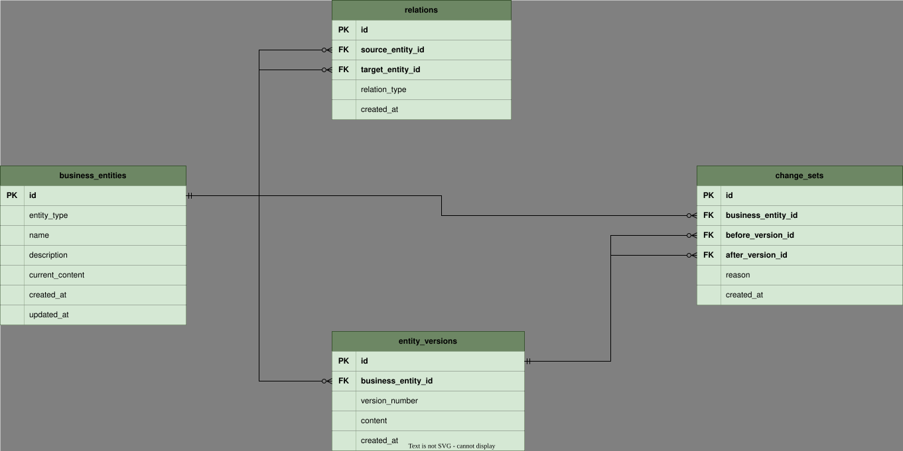

# MVPテーブル設計

## 1. 文書情報

| 項目 | 内容 |
|---|---|
| 文書状態 | 現行MVP実装済み・次期schemaは別文書で設計済み |
| 対象 | 現行MVPで永続化している論理テーブル |
| 設計レベル | 論理設計 |
| 最終更新日 | 2026-08-09 |

この文書では、MVPの中核フローに必要なテーブルと、その設計判断を定義します。
論理設計を正本とし、初期の物理実装にはPostgreSQLとDrizzle ORMを使用します。

この設計を現行MVPのmigrationとtransaction実装へ反映済みです。認証・組織追加後の論理
schema、組織分離、移行方針は
[認証・組織ワークスペース設計](authentication-and-organization.md)を次期実装の正本とします。
この文書の6章以降は、追加機能を実装するまで現行schemaの記録として維持します。

サービスの機能は[要件定義](../requirements/README.md)、データの意味は
[ドメインモデルと影響判定要件](../requirements/domain-and-impact.md)、処理との関係は
[論理データフロー設計](data-flow.md)、物理実装の方針は
[MVP技術選定](technology/README.md)を参照してください。共有状態の競合とリセットは
[公開デモの状態管理](demo-state.md)で定義します。

## 2. 設計状態の区分

| 区分 | 意味 |
|---|---|
| 決定 | MVPの中核概念として、実装方式にかかわらず維持する判断 |
| 暫定 | MVPを単純に実装するための初期判断。実装結果に応じて変更できる |
| 保留 | 技術選定または検証結果がなければ決められない判断 |

## 3. テーブル設計方針

1. 永続化対象は、現在の業務グラフと変更履歴に必要な4テーブルから始める。
2. 現在状態と履歴を分け、一覧・詳細表示のたびに履歴を復元しなくてよい構造にする。
3. バージョンは変更確定時点の内容をスナップショットとして保持する。
4. 差分と影響候補は、保存済みデータから再現できる算出値として扱う。
5. 未確定の変更案は、保存要件が決まるまで永続化テーブルにしない。
6. 認証、組織、権限、監査などMVP対象外の概念を先回りして追加しない。
7. 列挙値はアプリケーションの定数と文字列で始め、変更頻度が分かるまで
   データベース固有の列挙型やマスターテーブルに固定しない。
8. 削除はMVPの操作に含まれないため、関連データを自動削除するカスケードは使わない。

方針1、3、4、6は決定事項です。現在内容の重複保持、論理データ型、制約の実現方法は
暫定事項です。

## 4. ER図

[mvp-er-diagram.drawio.svg](mvp-er-diagram.drawio.svg)は表示用SVGであると同時に、
draw.ioの編集情報を埋め込んだ図の正本です。VS Codeのdraw.io拡張、またはdraw.io互換の
エディターで直接編集します。

図中はテーブル名、PK・FK、列名、カーディナリティに限定します。論理型、NULL可否、
制約と設計判断はこの文書で管理し、図を簡潔に保ちます。

現行ER図には、実装済みの4テーブルだけを記載します。認証・組織追加後の実装目標は
[次期ER図](authentication-and-organization.drawio.svg)で管理します。算出値、未確定状態、
初期データの供給元はテーブルではないため、本文で補足します。

### 4.1 ER図作成・更新ルール

既存図と追加図で表現が変わらないよう、次の形式を使用します。

- ファイル形式は`.drawio.svg`とし、表示用SVGへdraw.ioの編集情報を埋め込む。一時的な
  `.drawio`や画像だけのSVGを正本としてcommitしない。
- draw.ioのtable shapeを使用し、テーブル名を濃い緑の見出し、列を薄い緑の行として表す。
  現行図と同じ背景色、罫線、文字色、見出し高、行高を使用する。
- 左側にキー欄、右側に物理列名を置く。キー欄には`PK`、`FK`、`UQ`だけを記載し、
  主キー・外部キー・一意列の列名は太字にする。
- テーブル名と列名は、Drizzle schemaとmigrationで使うsnake_caseの物理名に合わせる。
- 外部キーを持つ行から参照先の主キー行へ線を引き、FK側を0以上、参照先を必須の1として
  crow's footで表す。複数の外部キーを一本の線へまとめない。
- 図にはテーブル名、PK・FK・UQ、列名、カーディナリティだけを載せる。論理型、NULL可否、
  CHECK、複合一意制約、index、認可規則は本文で管理する。
- 認証、組織、業務ドメインなど責務の近いテーブルを近くに置き、線がテーブルを横切らない
  配置を優先する。線が多い場合も、関係を省略して見た目だけを整えない。
- 更新後はSVGとして表示できること、draw.ioで再編集できること、本文と全テーブル・列・関係が
  一致することを確認する。
- テーブル、列、外部キーを変更するPull Requestでは、schema、migration、この文書、ER図を
  同時に更新する。実装前の提案図は、現行図と混同しないファイル名と文書状態を付ける。

## 5. 論理データ型

| 論理型 | 用途 | PostgreSQL初期型 |
|---|---|---|
| ID | テーブル内で一意な識別子 | `uuid` |
| 文字列 | 種別、名称、短い理由 | `text` |
| 長文 | 業務要素の本文 | `text` |
| 整数 | 要素ごとのバージョン番号 | `integer` |
| 日時 | 作成・更新・変更確定時刻 | `timestamptz` |

MVPの`content`は自由記述として`text`から始め、日時はUTCとして保存します。構造化された
項目単位の編集が必要になった場合に、列追加または`jsonb`への変更を検討します。

## 6. テーブル定義

### 6.1 `business_entities`

業務を構成する要素と、その現在内容を保持します。

| 列 | 論理型 | NULL | キー | 内容 |
|---|---|---|---|---|
| `id` | ID | 不可 | PK | 業務要素の識別子 |
| `entity_type` | 文字列 | 不可 |  | `PROCESS`、`RULE`、`DOCUMENT`、`ROLE`、`SYSTEM` |
| `name` | 文字列 | 不可 |  | 表示名 |
| `description` | 文字列 | 可 |  | 要素の短い説明 |
| `current_content` | 長文 | 不可 |  | 現在有効な内容 |
| `created_at` | 日時 | 不可 |  | 作成日時 |
| `updated_at` | 日時 | 不可 |  | 現在内容または基本情報の更新日時 |

`current_content`は、画面表示を単純にするための暫定的な重複保持です。同じ内容を
`entity_versions`にもスナップショットとして保存し、変更確定時に一つのトランザクションで
整合させます。

### 6.2 `relations`

二つの業務要素間にある有向の関係を保持します。

| 列 | 論理型 | NULL | キー | 内容 |
|---|---|---|---|---|
| `id` | ID | 不可 | PK | 関係の識別子 |
| `source_entity_id` | ID | 不可 | FK | 関係の起点となる業務要素 |
| `target_entity_id` | ID | 不可 | FK | 関係の終点となる業務要素 |
| `relation_type` | 文字列 | 不可 |  | 関係種別 |
| `created_at` | 日時 | 不可 |  | 作成日時 |

関係種別は`REQUIRES`、`REFERENCES`、`GOVERNED_BY`、`USES`、`OWNED_BY`、
`APPROVED_BY`、`PRODUCES`から始めます。関係の向きは影響候補の探索結果に関わるため、
起点と終点を入れ替えて同じ関係とは扱いません。

### 6.3 `entity_versions`

変更確定時点の業務要素の内容を、変更後も書き換えないスナップショットとして保持します。

| 列 | 論理型 | NULL | キー | 内容 |
|---|---|---|---|---|
| `id` | ID | 不可 | PK | バージョンの識別子 |
| `business_entity_id` | ID | 不可 | FK | 対象となる業務要素 |
| `version_number` | 整数 | 不可 |  | 要素ごとに1から増加する番号 |
| `content` | 長文 | 不可 |  | 確定時点の内容 |
| `created_at` | 日時 | 不可 |  | バージョンの作成日時 |

初期状態も`version_number = 1`として保存します。MVPで変更履歴の対象とするのは`content`です。
名称、種別、説明も変更履歴へ含める必要が生じた場合に、スナップショット範囲を拡張します。

### 6.4 `change_sets`

一回の変更確定を、変更前と変更後のバージョンの組として保持します。

| 列 | 論理型 | NULL | キー | 内容 |
|---|---|---|---|---|
| `id` | ID | 不可 | PK | 変更単位の識別子 |
| `business_entity_id` | ID | 不可 | FK | 変更対象の業務要素 |
| `before_version_id` | ID | 不可 | FK | 変更前のバージョン |
| `after_version_id` | ID | 不可 | FK | 変更後のバージョン |
| `reason` | 文字列 | 可 |  | 利用者が入力する変更理由 |
| `created_at` | 日時 | 不可 |  | 変更を確定した日時 |

初期バージョンは変更結果ではないため、対応する`change_sets`を作成しません。
認証をMVP対象外とするため、変更者の列は設けません。

## 7. 関係と制約

### 7.1 必須の関係

- `relations.source_entity_id`と`relations.target_entity_id`は、どちらも
  `business_entities.id`を参照する。
- `entity_versions.business_entity_id`は`business_entities.id`を参照する。
- `change_sets.business_entity_id`は`business_entities.id`を参照する。
- `change_sets.before_version_id`と`change_sets.after_version_id`は、どちらも
  `entity_versions.id`を参照する。
- 削除操作を追加するまでは、参照されている行の削除を拒否する。

### 7.2 必須の一意性と検証

- `relations`は`source_entity_id`、`target_entity_id`、`relation_type`の組を一意にする。
- `entity_versions`は`business_entity_id`、`version_number`の組を一意にする。
- `version_number`は1以上とする。
- 関係の起点と終点は異なる業務要素とする。
- 変更前と変更後には異なるバージョンを指定する。
- `before_version_id`と`after_version_id`が、`business_entity_id`と同じ業務要素に属することを
  検証する。

最後の検証は変更確定トランザクション内のアプリケーション処理で行います。単一テーブルで
表現できる外部キー、一意制約、CHECK制約はPostgreSQLにも定義します。

### 7.3 暫定の検索索引

次の検索経路は実装時に必要性を確認し、主キー・一意制約で不足する場合だけ索引を追加します。

- `business_entities.entity_type`
- `relations.source_entity_id`
- `relations.target_entity_id`
- `entity_versions.business_entity_id`と`version_number`
- `change_sets.business_entity_id`と`created_at`

## 8. 変更確定時の更新単位

一回の変更確定では、次の処理を一つのトランザクションとして実行します。

1. 対象要素をlockし、現在バージョンが入力された`before_version_id`と一致することを確認する。
2. 変更後の内容を新しい`entity_versions`として追加する。
3. 変更前と変更後を参照する`change_sets`を追加する。
4. `business_entities.current_content`と`updated_at`を更新する。
5. すべて成功した場合だけ確定し、途中で失敗した場合はすべて取り消す。

一致しない場合は何も更新せず、競合を表す型付き結果を返します。これにより、同じversionを
起点とする変更は一つだけが成功します。実装では対象の`business_entities`行を
`SELECT ... FOR UPDATE`でlockし、同一versionからの同時更新をintegration testで検証します。

### 8.1 サンプルリセットの更新単位

リセットでは、`change_sets`、`entity_versions`、`relations`、`business_entities`を参照制約に
従って削除し、seedから業務要素、関係、各要素の`version_number = 1`を再作成します。削除から
再作成までを一つのトランザクションで実行し、リセット自体は`ChangeSet`へ記録しません。

## 9. 現時点でテーブル化しないデータ

| データ | 扱い | テーブル化する判断条件 |
|---|---|---|
| 影響候補と関係経路 | 関係グラフから都度算出 | 保存結果の再利用や説明履歴が必要になったとき |
| 差分 | 二つのバージョンから都度算出 | 算出コストまたは表示の再現性に問題が出たとき |
| 未確定の変更案 | 画面またはアプリケーション状態 | 更新後の復元や複数端末での継続が要件になったとき |
| サンプル初期状態 | seedまたはfixture | 複数のサンプルを利用者が管理する要件が生じたとき |
| 利用者・組織・権限 | 次期設計でテーブル化を決定 | [認証・組織ワークスペース設計](authentication-and-organization.md)に従って実装する |
| 種別マスター | アプリケーション定数 | 利用者による追加・変更が必要になったとき |
| 関係の変更履歴 | MVP対象外 | 関係自体の差分や復元が必要になったとき |
| 監査イベント | MVP対象外 | 完全な監査証跡が必要になったとき |

## 10. 流動的な更新のルール

- 実装に必要な最小限の列・制約から追加し、将来用途だけを理由に追加しない。
- 新しい要件が現在の4テーブルで表現できない場合は、列追加、テーブル追加、算出処理の
  どれが最も単純かを比較する。
- テーブルまたは関係を変更したときは、この文書とER図を同じPull Requestで更新する。
- 永続データが存在する段階では、スキーマ変更と同時に移行方法も記載する。
- 実装が設計と異なる妥当な理由を持つ場合は、実装へ合わせて設計書を更新し、差を残さない。

## 11. 実装で確定した事項と保留事項

- UUIDはアプリケーションで`crypto.randomUUID()`を使って生成する。
- `content`はLFへ正規化したプレーンテキストとし、差分は行単位で算出する。

次はMVP後も保留します。

- 削除または無効化を導入する条件
- 将来の分岐、レビュー、承認、復元を表現する変更モデル
- 関係自体の変更履歴を扱う条件
