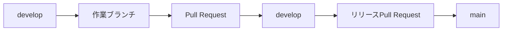

# GitHub運用ルール

## 1. 目的

この文書では、`process-diff-mvp`におけるブランチ、コミット、Pull Request、マージ、
リリースの基本ルールを定義します。

変更の目的とレビュー単位を明確にし、`main`を安定した状態に保ちながら、`develop`を
日常開発の統合先として運用することを目的とします。

## 2. ブランチの役割

### 2.1 `main`

- GitHub上のデフォルトブランチとする。
- 公開可能で、原則として常に動作する状態を保つ。
- 直接コミットまたは直接pushしない。
- `develop`からのリリースPull Request、または緊急修正だけを取り込む。

### 2.2 `develop`

- 日常開発の統合ブランチとする。
- 通常の作業ブランチは、最新の`develop`から作成する。
- 通常のPull Requestのマージ先とする。
- 直接コミットまたは直接pushしない。

### 2.3 作業ブランチ

- 一つのブランチでは一つの目的だけを扱う。
- 長期間残さず、作業が完了したらPull Requestを作成する。
- マージ後はGitHubとローカルから削除する。
- 別の変更が必要になった場合は、同じブランチへ追加せず新しいブランチを作る。

### 2.4 中間ブランチ

- 一つの大きな目的に属する複数のPull Requestを統合する、一時的なブランチとする。
- 最新の`develop`から作成する。
- 子となる作業ブランチのPull Requestだけを取り込み、直接コミットまたは直接pushしない。
- 完成した変更を`develop`へ取り込んだ後、GitHubとローカルから削除する。
- 長期運用せず、`develop`の代わりとして使用しない。

### 2.5 初回セットアップ

- GitHub上のリポジトリが空の場合に限り、ブランチ作成に必要な初期コミットを
  `main`へ一度だけ直接pushしてよい。
- 初期コミットにはプロジェクトの変更を含めず、リポジトリの初期化だけを目的とする。
- 初期コミット後に`develop`を作成し、`main`と`develop`のブランチ保護を直ちに設定する。
- 初回セットアップ完了後は、この例外を再利用せず、すべての変更をPull Requestから取り込む。

## 3. 通常の開発フロー



通常の作業は次の順で行います。

1. ローカルの`develop`を最新にする。
2. `develop`から作業ブランチを作成する。
3. 実装、テスト、必要な文書更新を行う。
4. 作業ブランチをpushし、`develop`向けのPull Requestを作成する。
5. レビューと検証を完了してからマージする。
6. リリース可能な状態になったら、`develop`から`main`へのPull Requestを作成する。

GitHubでは`main`がデフォルトのマージ先として選ばれる場合があるため、通常の作業Pull
Requestでは、マージ先が`develop`になっていることを必ず確認します。

### 3.1 中間ブランチを使う基準

通常は、作業ブランチから`develop`へ直接Pull Requestを作成します。次の条件をすべて
満たす場合だけ、中間ブランチの使用を検討します。

1. 全体として一つの機能、修正、またはリファクタリングを実現する変更である。
2. 全体を一つのPull Requestにすると大きすぎるため、独立してレビューできる複数の
   Pull Requestへ分ける必要がある。
3. 分割した変更を個別に`develop`へ入れると、機能が未完成になる、動作が不安定になる、
   または利用者に見せられない中間状態になる。
4. 複数の変更を統合した状態で、まとめて動作確認する必要がある。

次の理由だけでは、中間ブランチを使用しません。

- コミット数が多い
- 作業期間が長い
- 作業のバックアップ先が欲しい
- 互いに無関係な変更をまとめたい
- 一つのPull Requestとして十分にレビューできる

### 3.2 中間ブランチを使うフロー

1. 最新の`develop`から、全体の目的を表す中間ブランチを作成する。
2. 中間ブランチから、独立してレビューできる子の作業ブランチを作成する。
3. 子の作業ブランチから中間ブランチへPull Requestを作成する。
4. 子のPull Requestは、原則として`Squash and merge`で取り込む。
5. すべての子の変更を統合し、中間ブランチ上で動作確認する。
6. 中間ブランチから`develop`へPull Requestを作成する。
7. 中間ブランチから`develop`へのPull Requestは、原則として`Create a merge commit`で
   取り込み、子の変更単位を履歴に残す。
8. マージ後、中間ブランチと子の作業ブランチを削除する。

共有中の中間ブランチへ`develop`の更新を取り込む場合は、履歴を書き換えずmergeして
同期します。子の作業ブランチは、中間ブランチを基準に同期します。

## 4. ブランチ命名規則

### 4.1 形式

```text
<prefix>/<short-description>
```

- 接頭辞と説明は`/`で区切る。
- 説明は英小文字のkebab-caseを使う。
- 原則として2〜5語程度で、変更目的が分かる簡潔な名前にする。
- 実装方法ではなく、何を変更するかを表す。

例:

```text
feature/change-diff-view
fix/impact-path-duplication
style/entity-detail-layout
docs/github-workflow
```

### 4.2 接頭辞

| 接頭辞 | 用途 |
|---|---|
| `feature` | 新機能または利用者に見える機能追加 |
| `fix` | 通常の不具合修正 |
| `style` | UI、CSS、レイアウトなど、機能を変えない見た目の変更 |
| `chore` | 依存関係、設定、開発環境などの保守作業 |
| `docs` | 文書だけの追加または修正 |
| `refactor` | 外部仕様を変えない内部構造の改善 |
| `test` | テストだけの追加または修正 |
| `perf` | 外部仕様を変えない性能改善 |
| `hotfix` | `main`に対する緊急修正 |

接頭辞の追加が必要になった場合は、既存の接頭辞で表現できないことを確認してから、
この表へ用途とともに追記します。一度だけ使う曖昧な接頭辞は追加しません。

### 4.3 中間ブランチの命名

中間ブランチにも専用の接頭辞は設けず、全体の変更目的に合う既存の接頭辞を使います。
子の作業ブランチは、親となる中間ブランチの目的と担当範囲が分かる名前にします。

例:

```text
# 中間ブランチ
feature/change-review

# 子の作業ブランチ
feature/change-review-editor
feature/change-review-diff
style/change-review-layout
test/change-review-flow
```

## 5. コミットルール

### 5.1 基本原則

- 一つのコミットには、一つの論理的な変更を含める。
- `update`、`change`、`fix`だけのような、内容を特定できないメッセージを避ける。
- コミットメッセージの1行目は、変更内容を簡潔に表す。
- 必要な場合は本文に変更理由、制約、判断の背景を記載する。
- デバッグ用コード、不要なログ、秘密情報、個人環境の設定をコミットしない。
- レビュー不能な巨大コミットを避け、意味のある単位へ分ける。
- 各コミットの時点で、可能な限りビルド、テスト、型検査などが成立する状態を保つ。

### 5.2 コミットを分ける基準

次のいずれかに該当する変更は、原則として別コミットに分けます。

1. それぞれを独立して説明、レビュー、検証、または取り消しできる。
2. 機能追加、不具合修正、見た目の変更、リファクタリングなど、変更の目的が異なる。
3. コードの一括整形、ファイル移動、名前変更などの機械的変更と、振る舞いの変更が混在する。
4. 互いに依存しない複数の機能または不具合を変更する。
5. コミットメッセージを簡潔に書こうとしたとき、「〜と〜」のように複数の目的が必要になる。
6. 一方だけを取り消しても、もう一方が正しく成立する。

差分が生成物を除いて300行を超える、または10ファイルを超える場合は、分割できないかを
必ず見直します。これは上限ではなく、変更目的が一つであるかを再確認する目安です。

### 5.3 一つのコミットに保つ基準

次の変更は、分けると不完全または理解しにくくなる場合、同じコミットに含めます。

1. 一つの振る舞いを実現する実装と、その振る舞いを検証するテスト。
2. インターフェースまたはデータ構造の変更と、同時に修正しなければ動作しない利用箇所。
3. 依存関係の定義ファイルと、その変更によって更新されたlockファイル。
4. 一つの仕様変更に必要なコードと、同時に更新しなければ内容が不正確になる文書。
5. 単独ではビルド、テスト、型検査などを成立させられない相互依存した変更。

生成ファイル、lockファイル、スナップショット、大規模な名前変更は行数が増えやすいため、
差分量だけを理由に分割しません。ただし、振る舞いの変更とは可能な限り分離します。

### 5.4 作業途中のコミット

- ローカルでの試行中は一時的なコミットを作成してよい。
- Pull Requestを作成する前に、一時的な`WIP`、`fixup`、やり直しだけのコミットを整理する。
- 共有済みのブランチでは、ほかの作業者に確認せず履歴を書き換えない。

### 5.5 コミット、Pull Request、中間ブランチの粒度

| 単位 | 役割 | 判断基準 |
|---|---|---|
| コミット | 一つの論理的な変更 | 独立して説明、確認、取り消しできる最小単位 |
| Pull Request | 一つのレビュー可能な目的 | 完了条件と検証方法を一つにまとめられる単位 |
| 中間ブランチ | 複数Pull Requestの一時的な統合 | 個別に`develop`へ入れられない同一目的の変更群 |

コミットが大きいだけならコミットを分け、Pull Requestが大きいだけならPull Requestを
分けます。複数に分けたPull Requestを完成前に`develop`へ入れられない場合に限り、
中間ブランチを使用します。

### 5.6 コミットメッセージ

コミットメッセージは、次の形式を推奨します。

```text
<type>: <summary>
```

例:

```text
feature: 変更差分の表示を追加
fix: 影響候補の重複を除外
docs: GitHub運用ルールを追加
```

`type`は、原則としてブランチの接頭辞と同じ種類を使います。

## 6. GitHub Issues

- 本プロジェクトはMVPのため、GitHub Issuesを使用しない。
- 作業の目的、完了条件、確認結果はPull Requestへ記載する。
- 実装前に残す必要がある要件、設計、未決事項は`docs/`で管理する。
- ブランチ名にIssue番号を含めず、Issueの自動クローズ構文も使用しない。

## 7. Pull Requestルール

### 7.1 基本単位

- 一つのPull Requestでは一つの目的を扱う。
- 機能追加と無関係なリファクタリングを同じPull Requestへ混在させない。
- 大きな変更は、独立してレビューと検証ができる単位へ分ける。
- 早い段階で共有する必要がある場合はDraft Pull Requestを利用する。

### 7.2 記載内容

Pull Requestには、最低限次の内容を記載します。

- 目的と背景
- 主な変更内容
- 実行した確認またはテスト
- 影響する範囲
- 完了条件
- 未実施または確認できていない項目
- 画面変更がある場合は、確認できる画像または動画

### 7.3 マージ条件

次の条件を満たしてからマージします。

- Pull Requestの説明と差分が一致している
- 変更箇所に対応するテストまたは確認を実施している
- 未解決のレビューコメントがない
- 必要な設計書やREADMEが更新されている
- 秘密情報やユーザー固有情報が含まれていない

一人で開発している期間はGitHub上の承認を必須にしませんが、差分のセルフレビューと
検証結果の記録は省略しません。

## 8. マージ方式

### 8.1 作業ブランチから`develop`

- 原則として`Squash and merge`を使う。
- Pull Requestのタイトルを、マージ後の変更内容が分かる表現に整える。
- マージ後は作業ブランチを削除する。

### 8.2 `develop`から`main`

- リリースPull Requestを作成する。
- 原則として`Create a merge commit`を使い、`develop`との共通履歴を維持する。
- リリース前に中核フロー、公開ビルド、主要な受け入れ条件を確認する。
- リリース内容をPull Requestへ要約する。
- 公開バージョンを管理する段階になったら、必要に応じてバージョンタグを付ける。

`develop`から`main`へのマージでは、通常の作業Pull Requestと同じ理由でSquashを使いません。
長期ブランチ間の共通履歴を失い、次回リリースの差分が分かりにくくなることを避けるためです。

## 9. 緊急修正

公開中の`main`に重大な問題があり、通常の`develop`経由では対応が遅れる場合だけ、
`hotfix`を使用します。

1. 最新の`main`から`hotfix/<short-description>`を作成する。
2. 修正と必要最小限のテストだけを行う。
3. `main`向けのPull Requestを作成する。
4. マージ後、`main`の修正をPull Request経由で`develop`へ反映する。
5. `main`と`develop`の両方で修正を確認する。

緊急修正は、通常の作業ブランチを`develop`から作成するルールの唯一の例外です。

## 10. ブランチの同期と履歴

- 作業開始前に、リモートの最新状態を確認する。
- Pull Request作成前に、作業ブランチがマージ先の最新状態と大きく乖離していないか確認する。
- 自分だけが使用している未共有ブランチは、必要に応じてマージ先のブランチへrebaseしてよい。
- 他者と共有しているブランチでは履歴を書き換えず、マージ先のブランチをmergeして同期する。
- `main`と`develop`ではforce pushを行わない。
- 公開済みまたは共有済みのコミットを、理由なく書き換えない。

## 11. ブランチ保護

`main`と`develop`には、GitHubのRulesetまたはBranch protectionを必ず設定します。
どちらのブランチも直接変更せず、Pull Requestからのマージだけを許可します。

本プロジェクトはMVPのためCIを導入せず、Status checkをマージ条件にしません。変更箇所に
対応するテストと確認はローカルで実行し、結果をPull Requestへ記載します。

### `main`

- Pull Request経由の変更を必須にする
- 直接pushを禁止する
- force pushを禁止する
- ブランチ削除を禁止する

### `develop`

- Pull Request経由の変更を必須にする
- 直接pushを禁止する
- force pushを禁止する
- ブランチ削除を禁止する

## 12. 公開リポジトリとしての注意

- `.env`、トークン、秘密鍵、認証情報をコミットしない。
- 環境変数の例が必要な場合は、値を空またはダミーにした`.env.example`を使用する。
- 端末名、ローカルの絶対パス、個人アカウントの対応関係を記載しない。
- Pull Requestとコミットメッセージも公開情報として扱う。
- 実在する組織や業務の非公開情報を、サンプルデータやスクリーンショットへ含めない。

## 13. 作業開始前チェックリスト

- [ ] 通常作業は最新の`develop`、中間ブランチ配下の作業は最新の中間ブランチから開始している
- [ ] ブランチ名が命名規則に従っている
- [ ] 一つのブランチに一つの目的だけを設定している
- [ ] 作業の目的と完了条件を確認している

## 14. Pull Request作成前チェックリスト

- [ ] 通常は`develop`、子の作業ブランチは中間ブランチなど、意図したマージ先を確認した
- [ ] 変更箇所に対応するテストまたは確認を実施した
- [ ] 不要なログ、デバッグコード、秘密情報が含まれていない
- [ ] ユーザー固有の環境情報が含まれていない
- [ ] 必要な設計書またはREADMEを更新した
- [ ] Pull Requestへ確認結果と未確認項目を記載した
