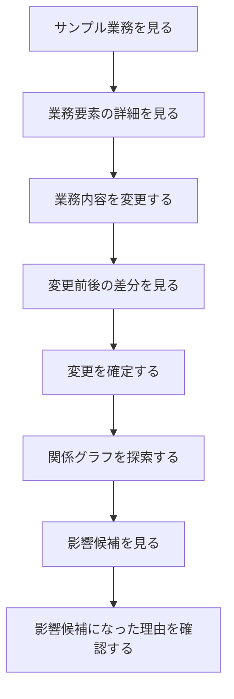

# process-diff-mvp 要件定義

## 1. 文書情報

| 項目 | 内容 |
|---|---|
| 文書状態 | 初期ドラフト |
| 対象 | コンセプト検証用MVP |
| 中心概念 | 業務のGit化 |
| 最終更新日 | 2026-08-09 |

## 2. 関連文書

| ファイル | 内容 | 読む場面 |
|---|---|---|
| [product-requirements.md](product-requirements.md) | 機能、非機能、UX、受け入れ条件 | 画面、機能、テストを検討するとき |
| [domain-and-impact.md](domain-and-impact.md) | データモデルと影響候補の判定 | ドメイン、データ、探索処理を検討するとき |
| [../design/data-flow.md](../design/data-flow.md) | 要件を処理とデータの流れへ展開した初期設計 | 画面、状態管理、API、保存方式を検討するとき |
| [../design/table-design.md](../design/table-design.md) | MVPで永続化する論理テーブルとER図 | データ保存、スキーマ、実装方式を検討するとき |

サービスの目的、MVPの範囲、検証方針を確認するだけであれば、このファイルだけを読みます。

## 3. サービス概要

企業内の複数の文書、ルール、システム、担当者に分散している業務を一つの構造として捉え、
業務を変更したときの差分と影響候補を可視化するサービスです。

中心となる価値は、次の問いに答えることです。

> この業務を変更したら、ほかに何を確認する必要があるか。

本プロジェクトでは、この設計思想を「業務のGit化」と呼びます。Gitがソースコードに対して
提供する状態、変更、差分、履歴、依存関係の考え方を業務へ応用します。ただし、利用者へ
Gitの専門用語をそのまま見せることは要件としません。

## 4. 背景と課題

企業の業務は、一つのシステムだけで完結するとは限りません。チャット、文書、申請フォーム、
社内規程、承認フロー、表計算、業務システムなどを横断して成立します。

個々のサービスは自身が管理するデータを理解できますが、複数サービスをまたぐ業務全体の
関係は、人間の記憶や経験に依存しやすい状態です。

そのため、業務ルールや手順を変更したときに、次の問題が発生します。

- 関連する文書やフォームの更新漏れ
- 古い手順と新しい手順の混在
- 部署や担当者による認識の差
- 影響範囲の調査にかかる時間と手戻り
- 誰が何を変えたのか説明できない状態
- 業務知識の属人化

## 5. プロダクトの目的

MVPでは、業務変更を安全に自動実行することではなく、次の仮説を検証します。

> 業務の変更前後と、その変更による影響候補を一緒に確認できれば、更新漏れや影響調査の
> 負担を減らせるのではないか。

利用者がサンプル業務を変更し、差分と影響候補を確認する一連の体験を通して、コンセプトの
理解しやすさと有用性を評価できる状態を目指します。

## 6. 「業務のGit化」の概念対応

| Gitで扱う概念 | 本サービスで扱う概念 | 画面上の表現候補 |
|---|---|---|
| Repository | 組織または業務領域 | 業務スペース |
| File / Object | 業務を構成する要素 | 業務、ルール、文書、役割、システム |
| Commit | 一回の変更単位 | 変更 |
| Diff | 変更前後の差 | 変更内容、変更前・変更後 |
| History | 変更の蓄積 | 変更履歴 |
| Dependency | 業務要素間の関係 | 関連項目、影響経路 |
| Pull Request / Review | 変更内容の確認 | 変更案、レビュー、承認 |
| Revert | 過去状態への復元 | 復元 |

MVPで必須とするのは、業務要素、関係、変更、差分、影響候補です。レビュー、承認、復元は
将来拡張として扱います。

## 7. 想定利用者

### 7.1 MVPの利用者

- サンプルデータを使ってコンセプトを評価する利用者
- 業務手順や運用ルールの変更に関わる担当者
- 複数のシステムや文書をまたぐ業務を把握したい担当者

### 7.2 将来の対象組織に関する仮説

- 複数部署と複数のSaaSを利用している組織
- 業務ルールの一部が担当者の記憶に依存している組織
- 大規模なBPM製品を導入するほどではないが、口頭管理では限界がある組織

対象業種、組織規模、最初に価値を感じる職種は、MVP検証後に絞り込みます。

## 8. MVPの対象範囲

### 8.1 必須範囲

- サンプルの業務要素を一覧および詳細で確認できる
- 業務要素間の関係を確認できる
- 一つの業務要素を編集できる
- 変更前と変更後の差分を確認できる
- 関係グラフをもとに影響候補を提示できる
- 影響候補になった理由または関係経路を確認できる
- 一連の体験を第三者が公開URLから試せる

### 8.2 対象外

- 課金
- 本格的な認証、組織管理、RBAC、SSO
- 外部SaaSとの本格的なAPI連携
- 実在企業の業務データの取り込み
- AIによる業務構造の完全自動生成
- 業務の自動実行やWorkflow Automation
- BPM EngineまたはProcess Mining
- 高度な競合検出
- 企業監査に対応する完全な監査証跡
- 本格的なレビュー、承認、公開ワークフロー
- 自動的な変更の巻き戻し

## 9. MVPの中核フロー

MVPの体験は、次の一文で説明できることを重視します。

> 業務を見る、変更する、差分を見る、影響候補を見る。

## 10. 検証したい仮説

- 「業務のGit化」という設計思想に価値を感じてもらえるか
- 変更前後の差分が業務変更の理解に役立つか
- 影響候補の提示が確認漏れの防止に役立ちそうか
- 関係経路の表示によって候補を信頼できるか
- どの業務領域で最も価値を感じるか
- 既存の文書管理、ワークフロー管理、BPM製品との違いを理解できるか

## 11. 主なリスク

### 11.1 業務モデルの作成負荷

現実の業務が整理されていない場合、業務要素と関係の登録に大きな負担がかかります。
MVPではサンプルデータを利用し、登録支援は将来の検討対象とします。

### 11.2 現実との不一致

保存した業務構造が更新されなければ、影響候補の信頼性が失われます。MVPの対象外ですが、
将来的には外部連携、変更検知、更新依頼などの仕組みが必要です。

### 11.3 誤検知と警告疲れ

影響候補が多すぎると確認されなくなる可能性があります。MVPでは候補になった理由を示し、
影響を断定しないことで、利用者が判断できる状態を目指します。

### 11.4 業務上の効果を説明できない可能性

思想への共感だけでは導入につながらない可能性があります。将来的には更新漏れ、手戻り、
影響調査、監査、オンボーディングにかかる時間の削減効果を検証する必要があります。

## 12. 未決事項

- 最初に検証するサンプル業務の題材
- 業務要素の編集対象を自由記述にするか、項目化するか
- 変更を確定するタイミングと保存方式
- ブラウザを更新した後も変更内容を保持するか
- 関係グラフの探索方向と探索する深さ
- 影響候補の並び順と重要度の表現
- グラフ表示を中核画面にするか、補助的な表示にするか
- MVP検証時に収集する定量・定性フィードバック
- 将来のレビュー、承認、公開、復元をどの単位で扱うか

## 13. 次に作成する設計書

要件の合意後、次の順で設計を具体化します。

1. MVPの画面一覧とユーザーフロー
2. サンプル業務と検証シナリオ
3. ドメインモデル設計
4. 影響候補の探索仕様
5. 画面設計
6. システム構成と技術選定
7. 実装計画と受け入れテスト
