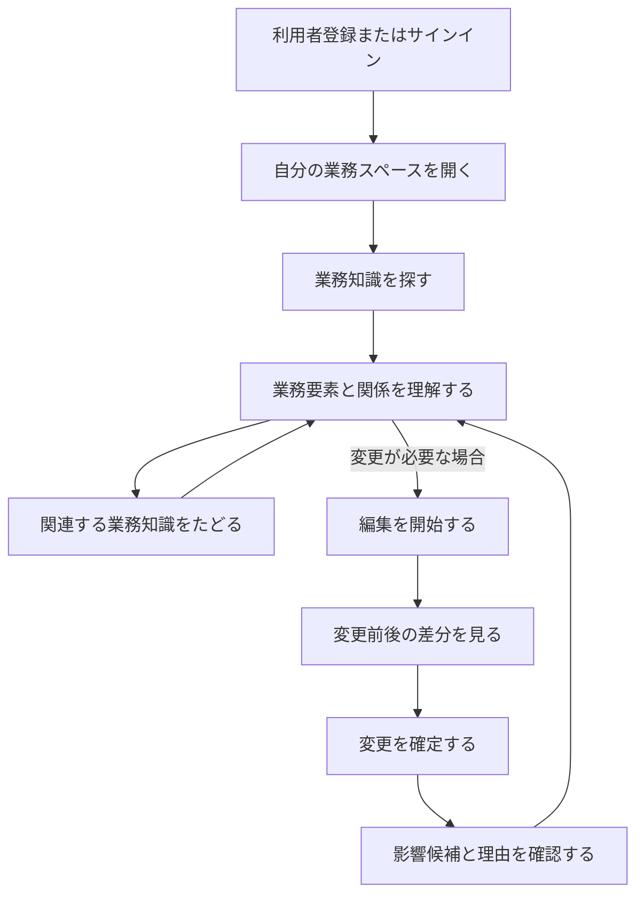

# process-diff-mvp 要件定義

## 1. 文書情報

| 項目 | 内容 |
|---|---|
| 文書状態 | ネイティブ業務実行方針反映済み |
| 対象 | 現行MVPと、日本企業向けの次段階プロダクト方針 |
| 中心概念 | 業務の定義、実行、知識、変更を一つにつなぐワークスペース |
| 最終更新日 | 2026-08-10 |

## 2. 関連文書

| ファイル | 内容 | 読む場面 |
|---|---|---|
| [product-requirements.md](product-requirements.md) | 機能、非機能、UX、受け入れ条件 | 画面、機能、テストを検討するとき |
| [domain-and-impact.md](domain-and-impact.md) | データモデルと影響候補の判定 | ドメイン、データ、探索処理を検討するとき |
| [mvp-gaps-and-product-direction.md](mvp-gaps-and-product-direction.md) | 現行MVPの不足点、今回補う設計、次期仮説の境界 | MVPの優先順位、事業仮説、将来拡張を判断するとき |
| [../design/native-business-workflows.md](../design/native-business-workflows.md) | ネイティブ業務実行、将来のAPI境界、次の実装段階 | 申請、作業、承認、期限、証跡、外部連携を設計するとき |
| [../design/screens-and-user-flow.md](../design/screens-and-user-flow.md) | SPAの画面一覧と中核ユーザーフロー | 画面、画面状態、操作導線を検討するとき |
| [../design/authentication-and-organization.md](../design/authentication-and-organization.md) | 認証、組織、権限、データ分離 | 認証または組織境界を実装・検証するとき |
| [../design/sample-business-scenario.md](../design/sample-business-scenario.md) | 経費精算のサンプル業務と基準シナリオ | seed、デモ手順、E2Eの期待値を確認するとき |
| [../design/impact-search.md](../design/impact-search.md) | 影響候補の探索、並び順、経路表示 | 探索ロジックと結果表示を実装するとき |
| [../design/demo-state.md](../design/demo-state.md) | 組織別サンプル状態、競合、リセット | 更新処理、組織分離、リセットを実装するとき |
| [../design/data-flow.md](../design/data-flow.md) | 要件を処理とデータの流れへ展開した初期設計 | 画面、状態管理、API、保存方式を検討するとき |
| [../design/table-design.md](../design/table-design.md) | MVPで永続化する論理テーブルとER図 | データ保存、スキーマ、実装方式を検討するとき |
| [../design/technology/README.md](../design/technology/README.md) | MVPの技術スタックと利用境界 | 実装、依存追加、デプロイ方式を検討するとき |

サービスの目的、MVPの範囲、検証方針を確認するだけであれば、このファイルだけを読みます。

## 3. サービス概要

企業内の業務を、知識として理解するだけでなく、申請、作業、承認、確認、完了まで実行し、
変更時は影響を確認しながら安全に更新できるワークスペースです。

プロダクトの中心は、業務、ルール、文書、システム、役割とその関係からなる`Business Graph`、
版管理された業務定義、一回ごとの案件、タスク、判断、証跡です。将来の外部APIはこの正規
ドメインへ入出力する追加手段とし、利用者は接続先がなくてもアプリ内で業務を完了できます。
現行MVPは、この到達点のうち業務知識の参照と安全な変更を架空のサンプルデータで検証します。

中心となる価値は、通常利用と変更時にそれぞれ次の問いへ答えることです。

> この業務では、どのルール、文書、システム、役割が、何のために関係しているか。
>
> この案件は今どこにあり、次に誰が何をすれば完了するか。
>
> この業務を変更したら、ほかに何を確認する必要があるか。

本プロジェクトでは、安全な変更管理を支える内部の設計思想を「業務のGit化」と呼びます。
Gitがソースコードに対して提供する状態、変更、差分、履歴、依存関係の考え方を業務へ
応用します。ただし、これはプロダクトの主ナビゲーションや通常利用時の見た目をGitへ
寄せることを意味しません。

### 3.1 プロダクト体験原則

次の原則を、画面構成、文言、ナビゲーション、機能優先度を判断する正本とします。

> The product should feel like a business knowledge workspace during normal use, and reveal
> Git-inspired change management only when the user edits something. Diff is not the product's
> primary navigation model; it is a safety mechanism inside the change workflow.

日本語では、次の設計判断として扱います。

- 通常利用では、現在の業務知識を探す、読む、関係をたどる、理解する体験を中心にする。
- `PROCESS`を通常利用の入口にし、関連ルール、文書、システム、担当・承認、前後工程を
  業務単位で理解できるようにする。
- 業務要素の一覧、分類、現在内容、関係を、常設の情報設計と主ナビゲーションにする。
- 利用者が明示的に編集を開始したときだけ、変更案、変更理由、差分確認、変更確定、影響候補を
  一つの変更フローとして段階的に見せる。
- 差分は独立した探索軸やプロダクトの入口ではなく、誤変更を防ぐための確認手段として扱う。
- 変更履歴や確定済み変更へのURLは再現性のために保持しても、通常利用の主導線には置かない。
- `commit`、`branch`、`pull request`などのGit用語や概念理解を利用者へ要求しない。

### 3.2 次段階のプロダクト体験原則

現行MVPの体験原則を維持しながら、次段階では次の原則を追加します。

- 通常利用の中心を、業務知識の参照だけでなく、自分の担当、承認待ち、案件、期限へ広げる。
- 申請、依頼、作業、承認、差し戻し、完了結果をアプリ内の一つの案件として扱う。
- 外部サービスへのリンクや自動操作だけで業務を成立させず、必要な入力と判断をアプリ内で完了できるようにする。
- 外部APIは、ネイティブな案件、タスク、判断、文書、予定、通知への入出力境界として扱う。
- `PROCESS`の説明、実行可能な業務定義、一回の実行案件を別概念として版管理する。
- 日本企業で必要になる多段承認、差し戻し、代理、部門条件、営業日、証跡、職務分離を論理設計へ含める。

具体的なドメイン、状態、画面、実装段階は
[ネイティブ業務ワークフロー設計](../design/native-business-workflows.md)で定義します。

## 4. 背景と課題

企業の業務は、一つのシステムだけで完結するとは限りません。チャット、文書、申請フォーム、
社内規程、承認フロー、表計算、業務システムなどを横断して成立します。

個々のサービスは自身が管理するデータを理解できますが、複数サービスをまたぐ業務全体の
関係は、人間の記憶や経験に依存しやすい状態です。

そのため、変更がない日にも次の認知コストが発生します。

- どのサービスを開けば必要な情報があるか覚える
- サービス間を移動して、最新情報と関連情報を探す
- ほかの部署や担当者へ情報の場所と例外運用を確認する
- 複数の情報を頭の中で業務単位に結びつける

情報を見つけた後も、申請フォーム、タスク、承認、連絡、証憑が別サービスに分かれていると、
次の実行コストが残ります。

- 何を入力し、誰へ依頼すればよいかを別の手順書で確認する
- 案件の現在地、次の担当者、期限を複数サービスから推測する
- 差し戻しや例外対応の経緯がチャットや口頭に残り、正式な案件記録と分離する
- 外部サービス間の転記と状態合わせを人が行う

また、業務ルールや手順を変更したときには、次の問題が発生します。

- 関連する文書やフォームの更新漏れ
- 古い手順と新しい手順の混在
- 部署や担当者による認識の差
- 影響範囲の調査にかかる時間と手戻り
- 誰が何を変えたのか説明できない状態
- 業務知識の属人化

## 5. プロダクトの目的

現行MVPでは、業務知識の管理や業務変更を完全に自動化することではなく、次の仮説を検証します。

> 日常的に業務知識を参照・理解できる場所へ安全な変更フローを組み込めば、知識を最新に
> 保ちながら、更新漏れや影響調査の負担を減らせるのではないか。

利用者が業務を起点に関連するルール、文書、システム、役割をたどる通常体験と、必要な
要素を変更して差分と影響候補を確認する変更体験の両方を、独立した検証シナリオとして
評価できる状態を目指します。

次段階では、知識を理解した利用者がそのまま業務を開始し、担当、承認、例外対応、完了までを
一つの案件として処理できるかを検証します。外部SaaS接続より先にネイティブな業務実行を
成立させ、APIは後から同じドメインへ接続します。現行MVPの限界と次期方針は
[MVPの不足点とプロダクト方針](mvp-gaps-and-product-direction.md)、詳細設計は
[ネイティブ業務ワークフロー設計](../design/native-business-workflows.md)で管理します。

## 6. 変更管理における「業務のGit化」の概念対応

次の対応は変更フローと内部モデルを設計するためのものです。通常利用の情報設計や
ナビゲーションをこの表から組み立てません。

| Gitで扱う概念 | 本サービスで扱う概念 | 画面上の表現候補 |
|---|---|---|
| Repository | 組織または業務領域 | 業務スペース |
| File / Object | 業務を構成する要素 | 業務、ルール、文書、役割、システム |
| Commit | 一回の変更単位 | 変更 |
| Diff | 変更前後の差 | 変更内容、変更前・変更後 |
| History | 変更の蓄積 | 変更履歴 |
| Dependency | 業務要素間の関係 | 関連項目、影響経路 |
| Pull Request / Review | 変更内容の確認 | 変更案、レビュー、承認 |
| Revert | 過去状態への復元 | 復元 |

MVPで必須とするのは、業務要素、関係、変更、差分、影響候補です。レビュー、承認、復元は
将来拡張として扱います。

## 7. 想定利用者

### 7.1 MVPの主な利用者

主な利用者は、従業員30〜300人程度の組織で、業務ルール、手順、業務改善に関わる社員です。
業務改善担当者、総務、情報システム担当、管理部門、現場リーダー、業務オーナー、
小規模組織のマネージャーを候補とします。

特に、会社の業務変更で確認漏れや手戻りを起こしたくなく、日常的にも「どこに何があり、
誰や何と関係するか分からない」ことに困っている利用者を対象とします。自分の組織の立場で
サンプル業務を理解し、必要な場合は変更して確認対象を洗い出します。

MVPでは次の状態を画面上で明示します。

- 認証された利用者の名前
- 操作対象の組織（業務スペース）
- 組織におけるアクセス権限
- 変更を確定した利用者

### 7.2 対象組織に関する仮説

- 従業員30〜300人程度で、複数部署と複数のSaaSを利用している組織
- 業務ルールの一部が担当者の記憶に依存している組織
- 大規模なBPM製品を導入するほどではないが、口頭管理では限界がある組織

対象業種と、候補のうち最初に価値を感じる職種は、MVP検証後に絞り込みます。

## 8. MVPの対象範囲

### 8.1 必須範囲

- サンプルの業務要素を一覧および詳細で確認できる
- 業務要素間の関係を確認できる
- `PROCESS`を入口に、関連するルール、文書、システム、担当・承認、前後工程を確認できる
- 編集しなくても、業務要素と関係をたどって現在の業務知識を理解できる
- 一つの業務要素を編集できる
- 編集開始後にだけ、安全な変更に必要な差分確認と影響候補を段階的に表示できる
- 変更前と変更後の差分を確認できる
- 関係グラフをもとに影響候補を提示できる
- 影響候補になった理由または関係経路を確認できる
- 一連の体験を第三者が公開URLから試せる
- 名前、メールアドレス、パスワードで利用者登録とサインインができる
- 利用者が自分の組織の業務データだけを参照・変更できる
- 組織と利用者の立場、変更者を画面上で確認できる

### 8.2 対象外

- 課金
- メール確認、パスワード再設定、OAuth、SSO、passkey、MFA
- 招待、メンバー管理、複数組織切り替え、動的RBAC
- 外部SaaSとの本格的なAPI連携
- 実在企業の業務データの取り込み
- AIによる業務構造の完全自動生成
- 業務の自動実行やWorkflow Automation
- BPM EngineまたはProcess Mining
- 高度な競合検出
- 企業監査に対応する完全な監査証跡
- 本格的なレビュー、承認、公開ワークフロー
- 自動的な変更の巻き戻し

### 8.3 次段階との境界

上記は現行MVPの対象外であり、プロダクト全体から恒久的に除外する意味ではありません。
次の実装段階では、既存の経費精算サンプルを、アプリ内の案件、入力、タスク、承認、差し戻し、
精算処理、完了証跡として実行できる最小モデルへ拡張します。外部API、AI生成、汎用visual
builderより先に、Connectorなしで業務が完結することを優先します。

次段階の対象と対象外は
[ネイティブ業務ワークフロー設計](../design/native-business-workflows.md#12-次の実装段階)を正本とし、
現行MVPのテーブルや受け入れ条件へ暗黙には追加しません。

## 9. MVPの中核フロー

MVPの体験は、次の一文で説明できることを重視します。

> 自分の組織の業務知識を探して理解し、必要なときだけ安全に変更する。

## 10. 検証したい仮説

- 通常利用時に、変更管理ツールではなく業務知識ワークスペースとして理解してもらえるか
- 変更操作をしなくても、業務を起点に必要な情報を探す場所として価値を感じるか
- 文書保管ではなく、企業の業務構造を扱うプロダクトとして理解してもらえるか
- 編集を開始したとき、変更フローへの切り替わりを自然に理解できるか
- 「業務のGit化」という内部設計思想を、Gitの知識なしで価値として体験できるか
- 変更前後の差分が業務変更の理解に役立つか
- 影響候補の提示が確認漏れの防止に役立ちそうか
- 関係経路の表示によって候補を信頼できるか
- どの業務領域で最も価値を感じるか
- 既存の文書管理、ワークフロー管理、BPM製品との違いを理解できるか
- 情報探索、他者への確認、影響調査、更新漏れ、オンボーディングのうち、どのコスト削減に
  最も投資価値を感じるか

## 11. 主なリスク

### 11.1 業務モデルの作成負荷

現実の業務が整理されていない場合、業務要素と関係の登録に大きな負担がかかります。
MVPではサンプルデータを利用し、登録支援は将来の検討対象とします。

### 11.2 現実との不一致

保存した業務構造が更新されなければ、影響候補の信頼性が失われます。MVPの対象外ですが、
将来的には外部連携、変更検知、更新依頼などの仕組みが必要です。

### 11.3 誤検知と警告疲れ

影響候補が多すぎると確認されなくなる可能性があります。MVPでは候補になった理由を示し、
影響を断定しないことで、利用者が判断できる状態を目指します。

### 11.4 業務上の効果を説明できない可能性

思想への共感だけでは導入につながらない可能性があります。将来的には更新漏れ、手戻り、
影響調査、監査、オンボーディングにかかる時間の削減効果を検証する必要があります。

### 11.5 変更管理が通常利用を支配する可能性

差分や履歴を常時前面に出すと、利用者が変更する用事のないときも専門的な変更管理ツールに
見え、業務知識を読む場所として定着しない可能性があります。通常利用と変更フローの境界を
画面状態と文言で明確に分け、差分は編集開始後の安全確認に限定します。

### 11.6 ナレッジベースに見える可能性

長文本文、ページ内目次、種類別一覧だけを強調すると、一般的な文書管理との違いが伝わらない
可能性があります。通常利用は`PROCESS`を入口にし、関連ルール、文書、システム、役割、
前後工程を業務構造として理解する表示を優先します。

### 11.7 導入直後に価値を返せない可能性

現行MVPは完成済みのサンプルグラフを使うため、Business Graphを作成・維持する負担と、
実際の業務を完了する価値を検証できません。次期検証では、完成済みの経費精算定義から案件を
開始し、入力、承認、完了まで進められる状態を先に作ります。定義を最初から顧客へ作らせず、
テンプレートから価値を確認した後に調整できる導入順を優先します。

### 11.8 ワークフロー製品の複雑さが先行する可能性

汎用builder、式言語、複雑な組織・権限、外部Connectorを同時に実装すると、日常業務が
完了する価値より設定機能が前面に出ます。最初は一つの経費精算シナリオを、汎用化可能な
最小の定義、案件、タスク、承認で表現し、利用者向けの実行体験から検証します。

## 12. 未決事項

- 自由記述の`content`を行、単語、文のどの単位で差分表示するか
- MVP検証で使用する被験者数と、観測項目ごとの合格基準
- 最初の経費申請で使う承認経路、添付、期限、公開権限の最小範囲
- メール確認とパスワード再設定を追加する時期
- 組織招待とメンバー管理を追加する時期

## 13. 設計の進行順

認証・組織追加後の利用者像、権限、データ所有境界、画面導線、移行方針まで設計済みです。
実装順序とテスト境界は
[認証・組織ワークスペース設計](../design/authentication-and-organization.md)で管理します。

業務を通常利用の入口にする変更と、業務理解・安全な変更の二つの検証シナリオはUIとE2Eへ
反映済みです。現在の実装境界は
[MVPの不足点とプロダクト方針](mvp-gaps-and-product-direction.md)と
[MVP画面構成とユーザーフロー](../design/screens-and-user-flow.md)で管理します。

次の設計段階は、外部API連携より先にアプリ内で業務を完了できるネイティブ業務実行です。
対象ドメイン、状態、画面、外部連携境界、最初の実装範囲は
[ネイティブ業務ワークフロー設計](../design/native-business-workflows.md)で管理します。
